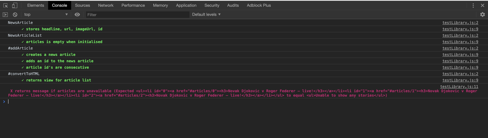

# News Summary App

### Description

Build a single page app that summarises the news

### Tech Stack

- JavaScript
- HTML
- CSS
- http-server (Static web server)
- Makers News Summary API (The Guardian & Ayelian text summarisation API's)
- Self made test framework
- ESLint (AirBnb Style guide)
- Prettier (Code formatting)
- npm

### Instructions

Clone the app, install the packages & run the server:

```
$ git clone https://github.com/Danielandro/news-summary-challenge.git
$ cd news-summary-challenge
$ npm install
$ npm start
```

#### Run tests

Go to the project directory in the terminal.

Run `open specRunner.html` (for Linux/Bash on Windows, run `xdg-open specRunner.html`)

Once it opens in your browser, open up your developer tools and click on the `console` tab. Passing tests print out in green, failing tests will be red.



### User Stories

#### In Progress

```
As a busy politician
I can see all of today's headlines in one place
So I know what the big stories of the day are
```

#### To Do

```
As a busy politician
I can click a link to see the original news article
So that I can get an in depth understanding of a very important story
```

```
As a busy politician
I can see a summary of a news article
So I can get a few more details about an important story
```

```
As a busy politician
I can see a picture to illustrate each news article when I browse headlines
So that I have something nice to look at
```

```
As a busy politician
I can read the site comfortably on my phone
Just in case my laptop breaks
```

```
As a busy politician
I can see whizzy animations in the app
To make my news reading more fun
```

## Progress + Challenges

**NewsArticle**

-> Has details for each news story:

- headline
- url
- imageUrl
- id (will use for routing)

**NewsArticleList**

-> Stores NewsArticles

-> Queries APIs for News & summaries (may need to extract into separate class)

-> Produces a view for headlines

## ToDos

- Implement NewsController to display stories on the page
  - Pull stories into NewsArticleList from Guardian/Makers API
  - show headlines on Index page when server is started
- Produce a view for summary of each article
- Display summary for each article
  - Include headline, image, summary

Resources

---

---

[Henry Cooksley Solution](https://github.com/hnryjmes/news-summary-challenge)
