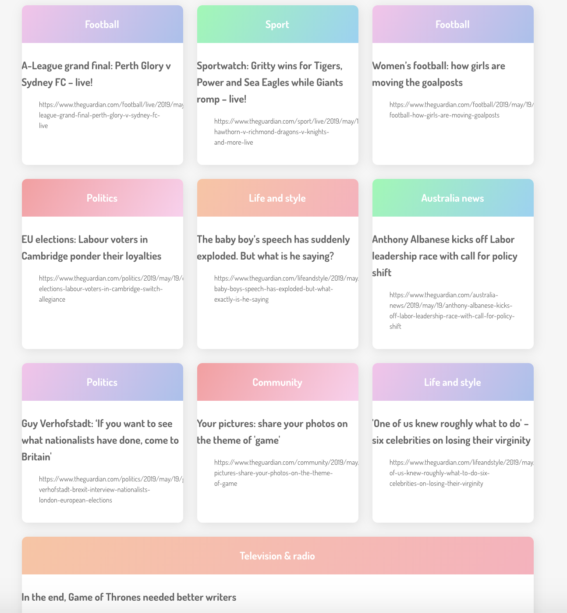

# News Summary challenge

Week 7 Makers Academy weekend challenge. The task is as follows:

"Your app will grab all the headlines from the Guardian newspaper API and display them on a page. You will write a single page web app. You'll write your code in frontend JavaScript, CSS and HTML. You won't use Ruby or backend JavaScript.

You won't use any libraries or frameworks. But, feel free to use the test framework you wrote during the week!"

### Using this app
* Clone this repo
* Install node if you haven't installed already
* From the command line, run `npm install http-server`
* You will need to sign up for a Guardian API key = https://open-platform.theguardian.com/access/
* In the `scripts.js` file, replace the text `api key` with your API key from The Guardian. Save the file.
* Enter `node node_modules/http-server/bin/http-server` from the command line and you will see a list of the latest headlines displayed:

<div align="center">
    
</div>

## What I gained from this challenge
I chose to attempt this challenge for the following reasons:
* I wanted more experience using APIs and understanding them. After following a tutorial and successfully connecting to The Guardian's API, I am happy that I have a better understanding of how they work and what is happening.
* After this week's Notes-App challenge, I wanted to practice vanilla JavaScript.
* This challenge helped me towards the goals **I can learn by myself** and **I can debug anything**. I have never tried to use an API in this context and doing so was quite challenging. It gave me the opportunity to debug new types of errors and I used `console.log()` a lot to gain visibility.

## To work on
* I would like to incorporate pictures for each article.
* I spiked this app - I would like to write tests for it. My reason for doing this was because my main goals were to practice JavaScript and improve my  understanding of APIs and I felt that spiking the app better served these goals. However, I would like to try and TDD this and stub my tests to avoid exceeding the daily limit.
* I would also like to figure out how to encrypt my API key.

## User Stories

```
As a busy politician
I can see all of today's headlines in one place
So I know what the big stories of the day are
```

```
As a busy politician
I can click a link to see the original news article
So that I can get an in depth understanding of a very important story
```

```
As a busy politician
I can see a summary of a news article
So I can get a few more details about an important story
```

```
As a busy politician
I can see a picture to illustrate each news article when I browse headlines
So that I have something nice to look at
```

```
As a busy politician
I can read the site comfortably on my phone
Just in case my laptop breaks
```

```
As a busy politician
I can see whizzy animations in the app
To make my news reading more fun
```

## Build Status
I think that an MVP has been achieved - all the headlines, summaries and links display on one page, categorised into the type of news that they are e.g. "Sport", "Politics" etc. Out of the user stories, I have successfully completed the first three but have not incorporated pictures or animations.

## Credits/Acknowledgments
- Makers Academy Week 7 Challenge
- Jordan Roberts
- In order to learn how to connect to an API using vanilla JavaScript (something I had never done before), I followed this very helpful tutorial:
https://www.taniarascia.com/how-to-connect-to-an-api-with-javascript/
