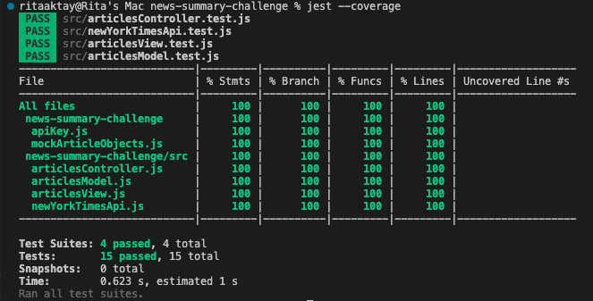
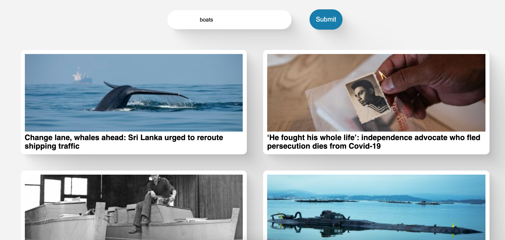
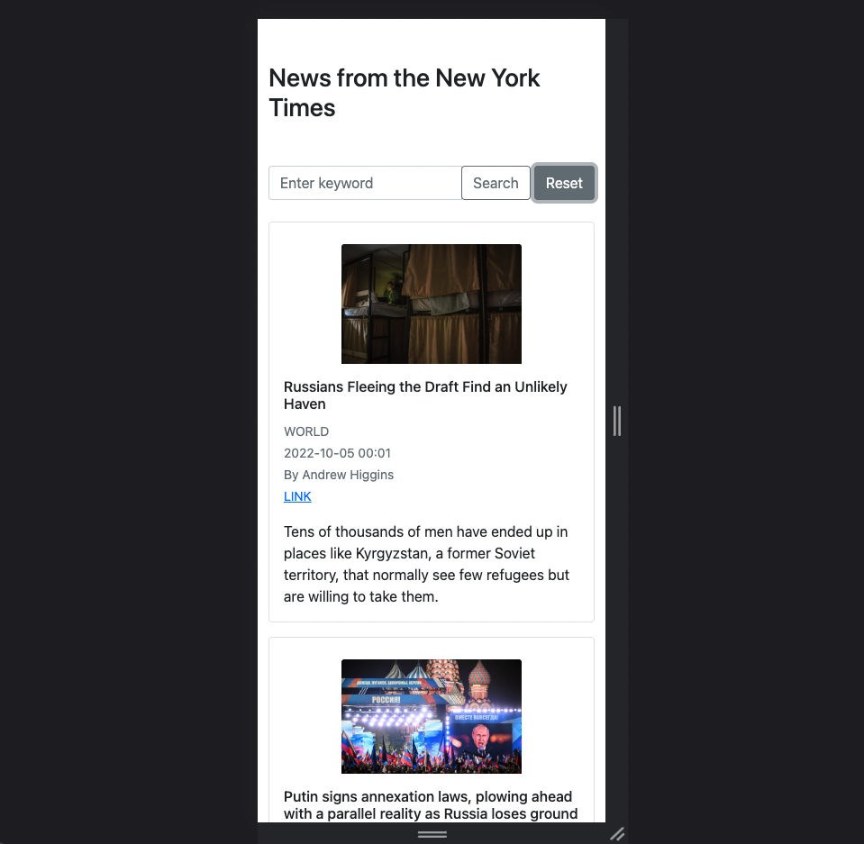

## News from the New York Times

A single page web-app showing latest news from the New York Times.

## Technologies

- It is written in Javascript
- It uses the [New York Times Top Stories API](https://developer.nytimes.com/docs/top-stories-product/1/overview)
- It uses the `http-server` npm package to run the server
- It uses Bootstrap for CSS

## Use

- Clone this repo
- Run `npm install`
- In the directory, run `http-server -c-1`
- Go to `http://localhost:8080`
- To run tests `jest`
- To run tests with coverage `jest --coverage`
- If you want to make any changes to the code run `npm run build`. This uses `esbuild` to recompile `bundle.js` so your updated script is in the html link tag.

## Test Coverage

## Images

#### Homepage

#### Search for 'Musk'

#### Mobile view

