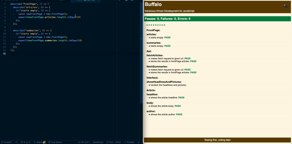
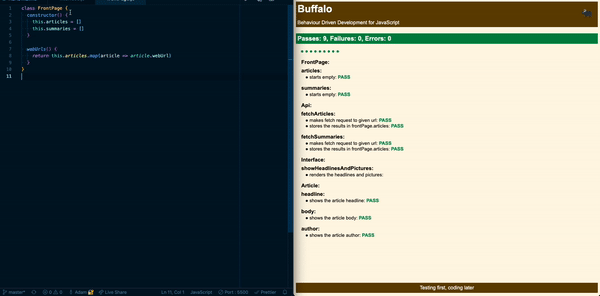

# News Summary challenge

A News Summary app:
- Written in JavaSript
- No libraries or frameworks - just pure js
- Uses APIs from the Guardian and Aylien to GET the articles
- Designed for Politicians using these [user stories](#user-stories)

## Getting Started

To use the app, checkout the deployed version here:

[The News](http://rebel-ocean.surge.sh/)
----------------------------------------

To modify and see the code:
```shell
git clone git@github.com:AJ8GH/news-summary-challenge.git
cd news-summary-challenge
```

To run tests:
```shell
open public/buffalo/SpecRunner.html
```

To open the app:
```shell
open public/index.html
```

## Design

***On Mac***


***On Mobile***


### api.js
- The api.js code makes requests to the Guardian API for the day's politics articles

```js
const POLITICS_URL = `https://content.guardianapis.com/search?from-date=${yesterday()}&to-date=${today()}&q=politics&api-key=test&show-fields=all`

function fetchArticles(url = POLITICS_URL) {
  fetch(url, {
    method: 'GET',
    mode: 'cors',
    headers: {
      'Content-Type': 'application/json'
    }
  }).then(response => response.json())
    .then(data => frontPage.articles = data.response.results);
}
```

- Functions `yesterday()` and `today()` generate the relevent dates to insert into the API request query string

- When a user clicks on a headline, the app makes a new request to the Aylien API to get a summary of the article

```js
function fetchSummaries(articleUrl) {
  const makersUrl = 'http://news-summary-api.herokuapp.com/aylien?apiRequestUrl='
  const aylienUrl = 'https://api.aylien.com/api/v1/summarize?url='
  const url = makersUrl + aylienUrl + articleUrl

  fetch(url, {
    method: 'GET',
    mode: 'cors',
    headers: {
      // ...
  }
}
```

- Use of test and development environment to stub API calls and ensure rate limit isn't breached

```js
  if (ENVIRONMENT === 'test') {
    const results = '{"response":{"status":"ok","results":"Test OK"}}'
    frontPage.articles = results;
    return results;
  }
```

### interface.js

- Templates the article data into index.html from the JSON responses

```js
function showHeadlinesAndPictures() {
  setTimeout(() => {
    let html = ''
    for (let i = 0; i < frontPage.articles.length; i ++) {
      const headline = frontPage.articles[i].fields.headline
      const thumbnail = frontPage.articles[i].fields.thumbnail
      html += `<br>`
      html += `<a class="headline" href="#${i}">${headline}</a><br>`
    }
    document.getElementById('headlines')
    .innerHTML = html
  }, 500)
}
```

### Testing framework

- In line with the guidelines for the week, there were no frameworks or libraries used in this challenge
- Testing was done using the framework Buffalo which I wrote in js.
- The framework reports the number of passes, failures and errors, and shows which tests are passing, giving information about why the failure or error occured





## User Stories

```
As a busy politician
I can see all of today's headlines in one place
So I know what the big stories of the day are
```

```
As a busy politician
I can see a relevant picture to illustrate each news article when I browse headlines
So that I have something nice to look at
```

```
As a busy politician
I can click a news headline to see a summary and a photo of the news article
So that I can get an in depth understanding of a very important story
```

```
As a busy politician
I can see click a news article summary title which links to the original article
So I can get a few more details about an important story
```

```
As a busy politician
I can read the site comfortably on my phone
Just in case my laptop breaks
```

```
As a busy politician
I can see whizzy animations in the app
To make my news reading more fun
```
