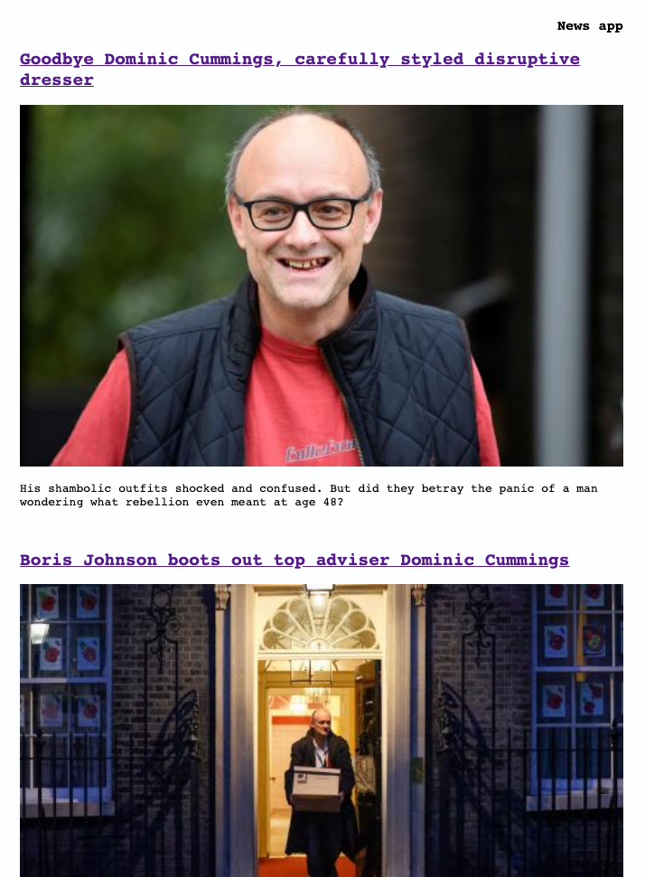

News Summary App
================

This frontend, single-page app retrieves information from the Guardian API to display tech news headlines, and uses the Aylien summarisation API to display a few sentences of each article when selected. It is written in pure JS, including my own testing framework that I built to test the app. The one exception to pure JS is the node `http-server` module, which is used to serve the app. Event listeners for button presses and hashchanges are kept in a separate file, and interact with the HeadlinesController and SummaryController respectively. The app has been tested for mobile viewing in Chrome.

## Screenshots / How to use
Here is the main headlines view as you load the app:

And here is an example summary page:

Clicking on the app title takes you back to the headlines view:

## To install this app
- Clone the repository.
- `npm install` inside the project folder to install dependencies.
- `npm start` will use `server.js` to serve the app at `http://localhost:3000`.
- `npm test` can be used *after* `npm start` to run the tests. Or visit `http://localhost:3000/test-runner.html` in your browser.
- The testing framework can be found in `/lib/test-framework.js`. Custom matchers can be added to the `matchers` function.
