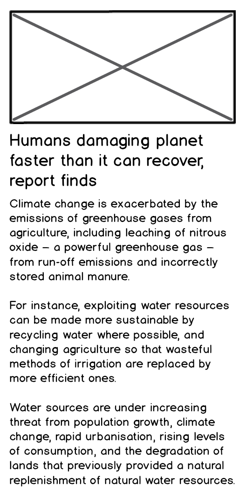

# News challenge

* Feel free to use Google, your notes, books, etc. but work on your own.
* If you refer to the solution of another coach or student, please put a link to that in
  your README.
* If you have a partial solution, **still check in a partial solution** and send in a pull
  request.
* You must submit a pull request to this repo with your code by 10am Monday morning.

## Challenge

As usual please start by forking this repo.

You'll create an app that shows the latest news using the Guardian API. You'll
find instructions on how to setup and use the API down this page.

## Project overview

Your app will grab all the headlines from the Guardian newspaper API and display them on a
page. Clicking on a headline will display the detailed article content.

### Technologies

You'll write a single page web app. You'll write your code in frontend JavaScript, CSS
and HTML. You won't use Ruby or backend JavaScript.

You're strongly encouraged to use the same tools and libraries you've been learning this week:
 * Jest to write your tests
 * The [`jest-fetch-mock`](https://www.npmjs.com/package/jest-fetch-mock) module (or similar) to mock `fetch` requests (so you don't request the API when running tests!)
 * A build tool such as `esbuild` to bundle files together

## User Stories

Some of these stories will need decomposing if they seem too large.

```
As a busy politician
I can see all of today's headlines in one place
So I know what the big stories of the day are
```

```
As a busy politician
I can see a relevant picture to illustrate each news article when I browse headlines
So that I have something nice to look at
```

```
As a busy politician
I can click a news headline to see a summary and a photo of the news article
So that I can get an in depth understanding of a very important story
```

```
As a busy politician
I can see click a news article summary title which links to the original article
So I can get a few more details about an important story
```

```
As a busy politician
I can read the site comfortably on my phone
Just in case my laptop breaks
```

```
As a busy politician
I can see whizzy animations in the app
To make my news reading more fun
```

## Mockups

### Headlines page


### Article summary page



## API

### API authentication

You'll need to [register and get an API key](https://open-platform.theguardian.com/access/) to use the Guardian API. 

### API request rate limits and stubbing

The Guardian API is severely rate-limited.

**Please stub your tests so we don't exceed the daily limit.  Otherwise, all requests will
be rejected and everyone's apps will stop working!**

## Guardian API Overview

**Remember to mock `fetch` in your tests to avoid exceeding the API rate limit**

### Listing latest articles

If you wanted to get the latest articles from the Guardian API, this is the cURL request
you might make.  Notice how it has a query parameter for `api-key`.

```
curl "https://content.guardianapis.com/search?q=&show-fields=thumbnail&order-by=newest&api-key=SECRET_API_KEY"
```

The above request will return a response similar to this one:
```json
{
    "response": {
        "status": "ok",
        "userTier": "developer",
        "total": 2322916,
        "startIndex": 1,
        "pageSize": 10,
        "currentPage": 1,
        "pages": 232292,
        "orderBy": "newest",
        "results": [
            {
                "id": "world/live/2022/jan/27/ukraine-crisis-nord-stream-2-gas-pipeline-russia-live-news-updates",
                "type": "liveblog",
                "sectionId": "world",
                "sectionName": "World news",
                "webPublicationDate": "2022-01-27T13:00:28Z",
                "webTitle": "Ukraine crisis: Russia ‘not optimistic’ but will keep talking with west – live coverage",
                "webUrl": "https://www.theguardian.com/world/live/2022/jan/27/ukraine-crisis-nord-stream-2-gas-pipeline-russia-live-news-updates",
                "apiUrl": "https://content.guardianapis.com/world/live/2022/jan/27/ukraine-crisis-nord-stream-2-gas-pipeline-russia-live-news-updates",
                "fields": {
                    "thumbnail": "https://media.guim.co.uk/cb78ab8cce355475da6c72f123f95d0d5912bd9b/0_261_6134_3681/500.jpg"
                },
                "isHosted": false,
                "pillarId": "pillar/news",
                "pillarName": "News"
            },
            {
                "id": "stage/2022/jan/27/dr-semmelweis-review-mark-rylance-bristol-old-vic",
                "type": "article",
                "sectionId": "stage",
                "sectionName": "Stage",
                "webPublicationDate": "2022-01-27T12:59:42Z",
                "webTitle": "Dr Semmelweis review – Mark Rylance’s riveting tale of medical hygiene pioneer",
                "webUrl": "https://www.theguardian.com/stage/2022/jan/27/dr-semmelweis-review-mark-rylance-bristol-old-vic",
                "apiUrl": "https://content.guardianapis.com/stage/2022/jan/27/dr-semmelweis-review-mark-rylance-bristol-old-vic",
                "fields": {
                    "thumbnail": "https://media.guim.co.uk/91cf03d6afc840af717fe794afc755214944a104/0_161_4928_2957/500.jpg"
                },
                "isHosted": false,
                "pillarId": "pillar/arts",
                "pillarName": "Arts"
            },
            // ...
        ]
    }
}
```

### Getting one article

Note that you can get the API URL for a specific article from the response of the
precedent section (in the `apiUrl` JSON property for an item).

If you wanted to get data for a specific article from the Guardian API, this is the cURL
request you might make:

```
curl "https://content.guardianapis.com/business/live/2022/jan/27/markets-hawkish-fed-us-rate-rises-ftse-dow-retail-inflation-growth-economy-business-live?show-fields=thumbnail&api-key=SECRET_API_KEY"
```


## Resources

* [Guardian newspaper API homepage](http://open-platform.theguardian.com/documentation/)
* cURL [man page](https://curl.haxx.se/docs/manpage.html)
* [Hurl](https://www.hurl.it/), a web interface for sending HTTP requests


<!-- BEGIN GENERATED SECTION DO NOT EDIT -->

---

**How was this resource?**  
[😫](https://airtable.com/shrUJ3t7KLMqVRFKR?prefill_Repository=makersacademy/news-summary-challenge&prefill_File=README.md&prefill_Sentiment=😫) [😕](https://airtable.com/shrUJ3t7KLMqVRFKR?prefill_Repository=makersacademy/news-summary-challenge&prefill_File=README.md&prefill_Sentiment=😕) [😐](https://airtable.com/shrUJ3t7KLMqVRFKR?prefill_Repository=makersacademy/news-summary-challenge&prefill_File=README.md&prefill_Sentiment=😐) [🙂](https://airtable.com/shrUJ3t7KLMqVRFKR?prefill_Repository=makersacademy/news-summary-challenge&prefill_File=README.md&prefill_Sentiment=🙂) [😀](https://airtable.com/shrUJ3t7KLMqVRFKR?prefill_Repository=makersacademy/news-summary-challenge&prefill_File=README.md&prefill_Sentiment=😀)  
Click an emoji to tell us.

<!-- END GENERATED SECTION DO NOT EDIT -->
