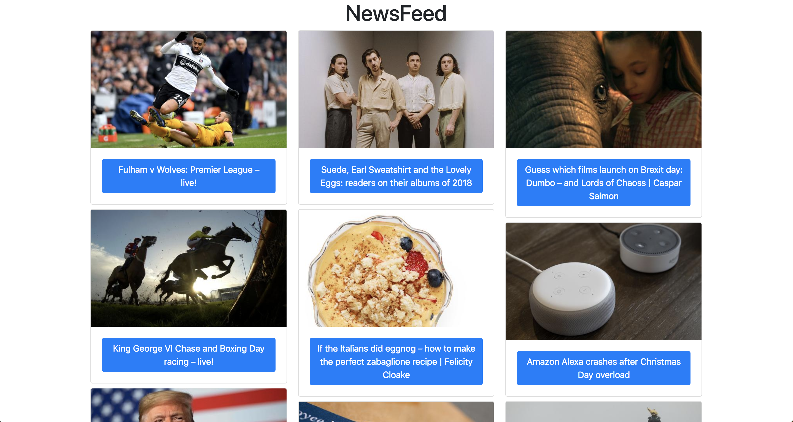

# News Summary challenge

I built the SPA App using vanilla JS and my own basic testing Framework 'tea'.

## How to use

* `git clone https://github.com/chrisjgilbert/news-summary-challenge`  
* `npm install`
* Add your Guardian API Key in `src/news-article-list-model.js` to `var guardianQueryUrl = "http://content.guardianapis.com/search?show-fields=body,headline,thumbnail&api-key=" + YOUR_API_KEY`
* `open index.html`    

## Run the tests

* `open spec-runner.html`
* view the browser console (cmd + option + i for a Mac using Chrome)   
* if Chrome fails to load the mock api for the relevant tests, `open /Applications/Google\ Chrome.app/ --args --allow-file-access-from-files` to allow opening of local files with a XMLHttpRequest.   

## Desktop NewsFeed view

  

## Mobile Article view

  

## User Stories

```
As a busy politician
I can see all of today's headlines in one place
So I know what the big stories of the day are
```

```
As a busy politician
I can click a link to see the original news article
So that I can get an in depth understanding of a very important story
```

```
As a busy politician
I can see a picture to illustrate each news article when I browse headlines
So that I have something nice to look at
```

```
As a busy politician
I can read the site comfortably on my phone
Just in case my laptop breaks
```
