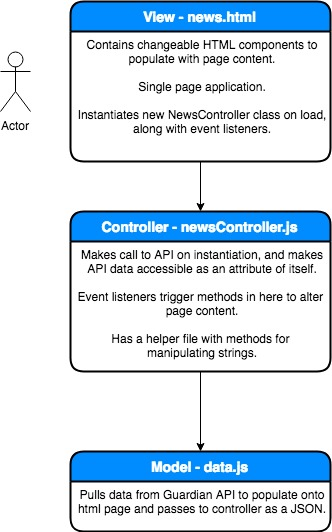

# News App

This is a single page news app, solving the Makers challenge.

# Limitations

For full disclosure, this project doesn't use any explicit testing. Whilst I began writing tests, my main aim for this project was to explore aspects of Javascript I was less familiar with, so rather than writing tests I focused on playing around with new things.

I'd like to come back later and rewrite this properly using TDD.

# To run the application

This application uses data from the Guardian Open Platform (https://open-platform.theguardian.com). To use this application, you'll need to do is to sign up to the service to get your own API key. Save this in a file called `api-key.js` with the API key stored as a variable called `apiKey`. The file and the variable itself are referenced throughout the application and necessary to run it with real data.

# Application structure

This is the structure of the MVC model:

There's also a controller helper methods file in the root directory, which removes string methods out of the controller to keep it skinny.
