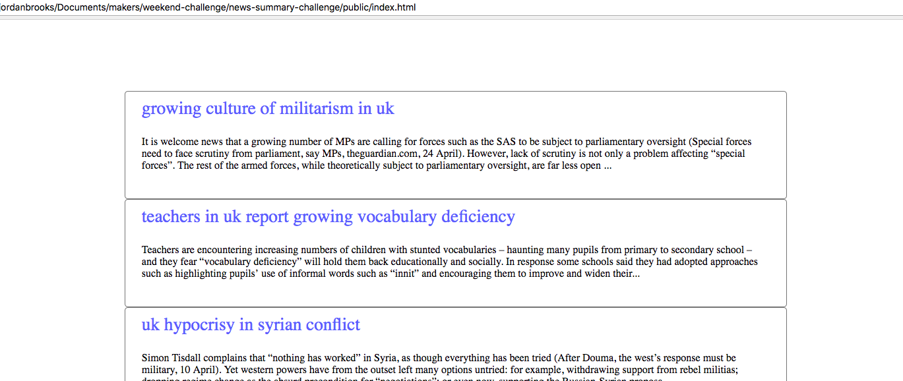

# Chitter Challenge
## Makers Academy weekend challenge to create a new summary website in vanilla-js

[Challenge Specification](https://github.com/makersacademy/news-summary-challenge)
## Tech:
just javascript! 



## Setup:
   ```
   $ git clone https://github.com/jbropho/news-summary-challenge
   $ cd news-summary-challenge

   run ./public/index.html in your browser
   ```
## Tests 
  Open spec/SpecRunner.html in your browser and open the console

## Approach
The challenge was to build a single page web application that would make up to three seperate api calls,
without the use of any framework's or libraries. I decided to write the simplest working version I could and incrementally refactor
my design to improve the maintainability of the code. Making asynchrous api calls in vanilla js could easily become messy and I made it my focus
to handle this complexity.

## Positives
* Improved my understanding of asynchronous design patterns
* Used es6 promises for the first time
* Completed first draft of testing framework developed during the week, extending my knowledge of closures in javascript

## If I had more time
* Finish refactoring to use promises when making the api call to the text summary api
* Add an image to each news story by querying a third api with the 'category' returned from the guardian api

## Focus for the next week
* Learn how to use an array of promises 
* Continue reading into/practicing functional javascript
