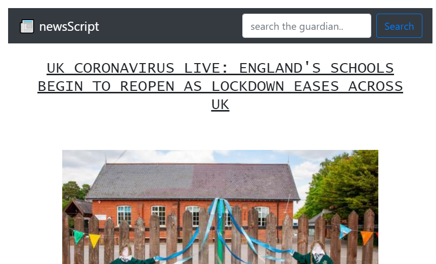

# News Summary challenge

# 

## Project overview

Browser based newsreader app that grabs the main stories for the UK from the Guardian newspaper API and displays them on a page. Once loaded, the user is also able to search for stories on their chosen subject.

### Technologies

JavaScript, Guardian newspaper api,  CSS and HTML.  


### To Do

* Display an expandable summary of each news story on the main page.
* Enable the user to specify the story subject(s) used by the app. ie UK, Politics, Technology, Cookery.
* Add some 'whizzy' animations to the app.
* Setup the app to use its own httpserver.

## User Stories

Implemented:

```
As a busy politician
I can see all of today's headlines in one place
So I know what the big stories of the day are
```

```
As a busy politician
I can see a picture to illustrate each news article when I browse headlines
So that I have something nice to look at
```

```
As a busy politician
I can read the site comfortably on my phone
Just in case my laptop breaks
```

```
As a busy politician
I can click a link to see the original news article
So that I can get an in depth understanding of a very important story
```
-----------------------------------------------------------------------------
To Do:

```
As a busy politician
I can see a summary of a news article
So I can get a few more details about an important story
```

```
As a busy politician
I can see whizzy animations in the app
To make my news reading more fun
```


## API

### API authentication

The github version of this app is set up to use the Guardian newspapaer api's 'test' api-key.  In order to use this app fully you should sign up for your own api-key using the link below and update   var apiKey ="test" in  /config.js to use "your-api-key".

https://open-platform.theguardian.com/access/

> Why is it bad to store API keys in your front-end?  If we hadn't provided this API for you to use, how would you avoid this?

### API request rate limits and stubbing

The Guardian newspaper developer API is rate-limited.

* Up to 12 calls per second
* Up to 5,000 calls per day
* Access to article text
* Access to over 1,900,000 pieces of content
* Free for non-commercial usage


### API Overview

The app sends an `apiRequestUrl` query parameter to the Guardian newspaper API and itterates over the JSON response to access the webTitle, thumbnail and bodyText for each story.

### Guardian API example

If you wanted to get the content of an article from the Guardian API, this is the cURL request you might make.  Notice how it has a query parameter for `api-key`.

```
curl "http://content.guardianapis.com/politics/blog/2014/feb/17/alex-salmond-speech-first-minister-scottish-independence-eu-currency-live?show-fields=body&api-key=SECRET_API_KEY"
```
