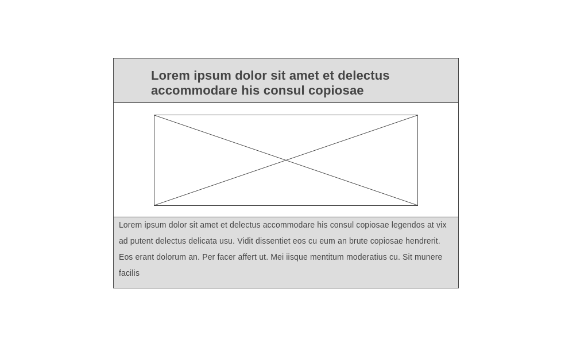

# News Summary challenge

Together, myself and [Katie](http://www.github.com/ktcornish/), have created a one-page news summary app to practice using API's. This uses a Guardian API and a Makers Summery API to take the UK's top news stories.

Our aim was to print the title of each story along with a summary, image and link to the original article as per the user stories.

## User Stories

```
As a busy politician
I can see all of today's headlines in one place
So I know what the big stories of the day are
```

```
As a busy politician
I can click a link to see the original news article
So that I can get an in depth understanding of a very important story
```

```
As a busy politician
I can see a summary of a news article
So I can get a few more details about an important story
```

```
As a busy politician
I can see a picture to illustrate each news article when I browse headlines
So that I have something nice to look at
```

```
As a busy politician
I can read the site comfortably on my phone
Just in case my laptop breaks
```

```
As a busy politician
I can see whizzy animations in the app
To make my news reading more fun
```

## Mockups

### Individual story



### Main page


### Additional notes

* The Guardian API is being run on a personal account. We have created a variable with the API Key and saved this in a .gitignore file. To use this app you will need to register for a key and create a variable in the manner below:

```
var config = {
  MY_KEY : 'SECRET-API-KEY',
}
```

* The Makers summary API has a limit on requests. We wished for our text to still be populated and therefore needed to add text which did not send a request to the API. We have commented out our working function and replaced it with 'lorem ipsum' generated text.  
