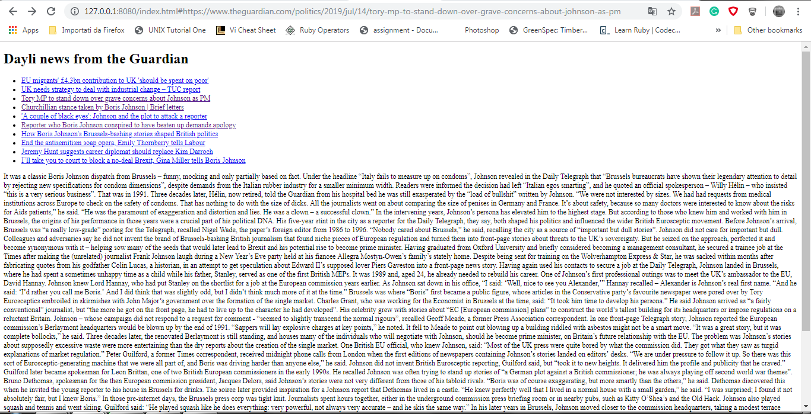

# NEWS SUMMARY CHALLENGE

The app will grab all the headlines from the Guardian newspaper API and display them on a page.  Clicking on a headline will show a summary of the article.

## User stories

```
As a busy politician
I can see all of today's headlines in one place
So I know what the big stories of the day are
```
```
As a busy politician
I can click a link to see the original news article
So that I can get an in depth understanding of a very important story
```

## Screeshot


