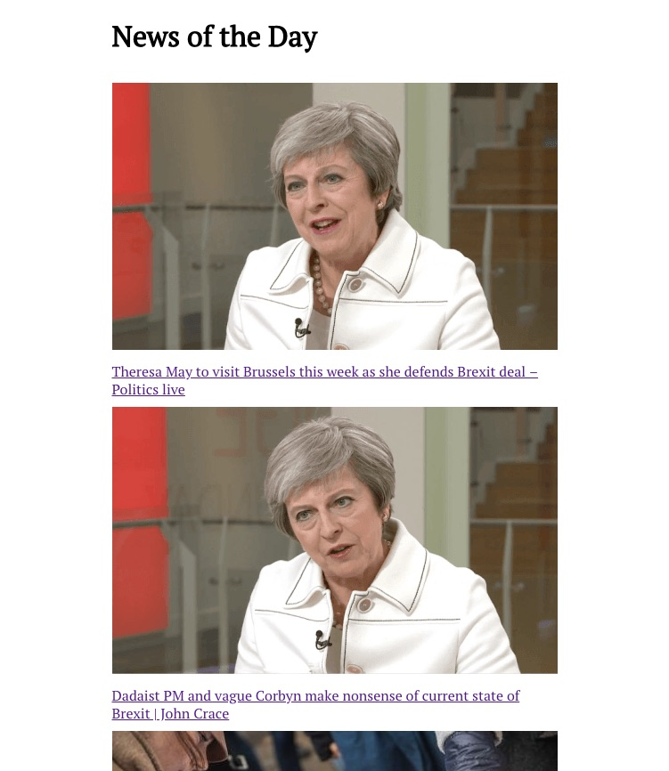
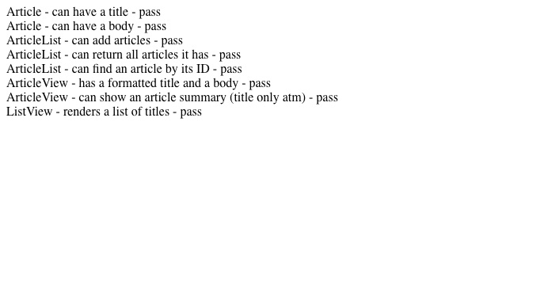

### Intro

This is an incomplete single page app, built at the end of Week 7 at Makers Academy. It is built using only Javascript, this includes the testing framework and event listeners.

To run:
- open index.html in your browser to see the app
- open SpecRunner.html in your browser to see test results

#### The App

#### Test results:

### My approach to the challenge

- A simple testing framework that does two things: asserts two things as equal, and asserts presence of content on a page, which I used for feature tests.
- Five classes:
  - article
  - article view
  - article list
  - article list view
  - controller, which listens for events and fetches Guardian API for article images, titles and full article text
- Not all tests are written, and of those not all are isolated
- At the moment, title links are set up correctly, but nothing happens when they are clicked

### What I would do given more time:
In rough order:
- Write controller tests
- Isolate article list view and controller tests
- Finalise hashchange event listener, so that on click, the app shows full article view with 'back' button
- Include "submit" event listener, to change view back to article list from single article view
- Work with Aylien API to show summary of each article on front page
- Create app.js and include that in index.html, instead of Controller.  App.js would create a new controller and have it display the article list. Controller would thereafter be responsible for everything else.
- Refactor controller code - it has too many responsibilities.
- Refine styling
