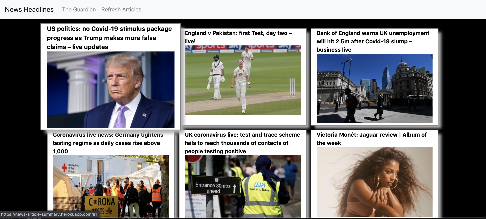
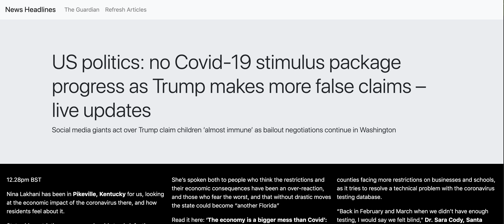

# News Summary challenge

This is a project to practice Single page Web Apps, AJAX requests, using vanilla HTML, CSS, and JS, and creating a testing framework.

The app used the Guardian newspaper API to get headline information which is then rendered to screen in a list view. Clicking on a headline will then show the beginning on the full article.

## Visit the site

The app is deployed [here](https://news-article-summary.herokuapp.com/).

## Screen Previews





## User Stories

Some of these stories will need decomposing if they seem too large.

```
As a busy politician
I can see all of today's headlines in one place
So I know what the big stories of the day are
```

```
As a busy politician
I can click a link to see the original news article
So that I can get an in depth understanding of a very important story
```

```
As a busy politician
I can see a summary of a news article
So I can get a few more details about an important story
```

```
As a busy politician
I can see a picture to illustrate each news article when I browse headlines
So that I have something nice to look at
```

```
As a busy politician
I can read the site comfortably on my phone
Just in case my laptop breaks
```

```
As a busy politician
I can see whizzy animations in the app
To make my news reading more fun
```

## Mockups

### Headlines page


### Article summary page


## Approach

My main aims for this app were:

1. Understand APIs & how to use them

2. Understand asynchronous functions in JavaScript

3. Improve my css skills & utilise Bootstrap

4. Create and use my own testing framework

### Planning

I began by exploring the Guardian API. After getting my API key set up I made a simple function that would call the API and console.log the response.

I then explored the API docs and used parameters to change the information I received and finally decided on a design that would be Headline & image of each article for the list-view page, and then the summary-view would have the headline, and the body of the article, up to a certain length.

I explored Bootstrap examples and settled on a grid view for the list-view, and a standard layout for the summary-view, but with a jumbotron style for the headline.

For the code, I knew I would want to take the guardian API response and put the articles into their own class so I could easily get to the relevant information, an API request function that would be asynchronous, 2 classes that would convert the article models into html strings for both syle of pages, and finally an interface which would just be event listeners that would call the functions to render tha pages.

For testing, I created a very basic testing framework that would console.log the results to a test.html, and had only one assert that would test that the outcome matched an expected outcome.

### Guardian API

It took a while to understand how best to use asynchronous functions, as I started using 'await', however found using 'fetch' far more straightforward.

### Article Model

The article model was straightforward as it was just holding static information. The trickey element was cutting the article body, ensuring it was cut at an appropriate place. For this, I explored how the body was sent via the API and saw that it was conveniently broken into paragraphs so simply decided to limit the body to the first 8 paragraphs.

### Article List-View and Summary-View

These were easy to create, but had to be changed an excessive amount of times when working on CSS and using divs. They are refactored now, , however it was a nightmare to play with and have tested at the same time.

### Interface

I used this to render the pages and add the hashchange event listener that would be used to change the single page view. I originally triggered the hash change through a form, however that was putting the hash change as a parameter, therefore I reverted to using links which worked much better.

I then introduced a back button that would take the user from the summary-view to the list-view and decided to use a hashchange for this and introduce an if statement in the hash change event listener to facilitate this.

I finally introduced a refresh article button with an event listener that would trigger a new API request. At this stage Interface had become cluttered with a mix of functions and event listeners, so I decided to move the functions into a new file called Page Controller.
