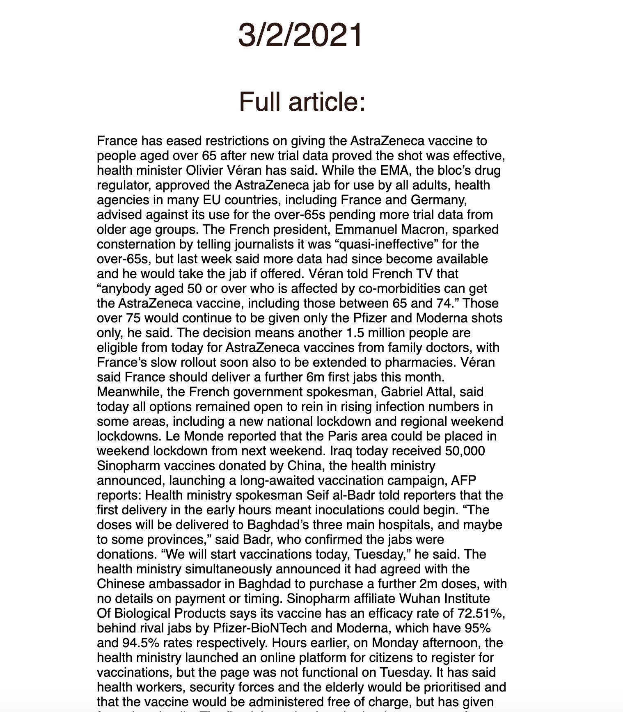

# News Summary App
This is a news summary single web page app built in JavaScript.

## Pre-requisites
In order to run this application, please install Node.js on your local machine.

## Run locally
In order to run this application locally, please run the following commands:
```bash
cd /path/to/the/root/folder/of/this/project
npm install
npm start
```

Then, please go to http://127.0.0.1:8081/ from your browser to use this application.

## Project overview

The app will grab all the headlines from the Guardian newspaper API and display them on a page.  Clicking on a headline will show a summary of the article.
Since the Aylien API has a low API request limit (as it is directed via Makers API), in case of API fetch failure, I have replaced the summary text with the full article body.


## User Stories

```
As a busy politician
I can see all of today's headlines in one place
So I know what the big stories of the day are
```

```
As a busy politician
I can see a relevant picture to illustrate each news article when I browse headlines
So that I have something nice to look at
```

```
As a busy politician
I can click a news headline to see a summary and a photo of the news article
So that I can get an in depth understanding of a very important story
```

```
As a busy politician
I can see click a news article summary title which links to the original article
So I can get a few more details about an important story
```

```
As a busy politician
I can read the site comfortably on my phone
Just in case my laptop breaks
```

```
As a busy politician
I can see whizzy animations in the app
To make my news reading more fun
```


## API Resources

* [Guardian newspaper API homepage](http://open-platform.theguardian.com/documentation/)
* [Aylien text summary API docs](http://docs.aylien.com/docs/summarize)


## **Main Page**

## **Full Article**

