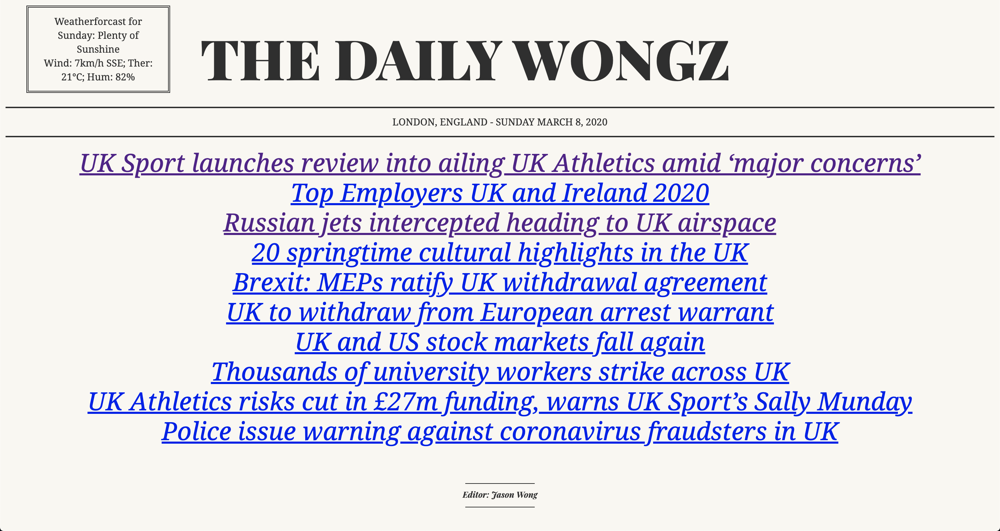

# News Summary challenge 📰

Check it out right now, [click here](http://news-summary-js.surge.sh/)!



[Objective](#Objective) |  [Installation](#Installation) | [Technologies](#Technologies) | | [User Stories](#user_stories) | [Mockups](#Mockups) | [Further adjustments](#further_adjustment)

## <a name="Objective">Objective</a>

Create a single page web app that summarises the news. It sources all the headlines from the Guardian newspaper API and display them on a page.  
Clicking on a headline will show a summary of the article, using the Aylien text summary API.

This app is based on the Makers weekend challenge 7. [Click here](https://github.com/makersacademy/news-summary-challenge) for the original README.md.


## <a name="Installation">Installation</a>

Follow these instructions to use the news app and install node http server:

```
$ git clone https://github.com/jasylwong/news-summary-challenge.git
$ cd news-summary-challenge
$ npm install http-server -g
$ http-server
```
To view the app navigate to: http://localhost:8080/


## <a name="Technologies">Technologies</a>

JavaScript, CSS and HTML

## <a name="user_stories">User stories</a>

```
As a busy politician
I can see all of today's headlines in one place
So I know what the big stories of the day are
```

```
As a busy politician
I can click a link to see the original news article
So that I can get an in depth understanding of a very important story
```

```
As a busy politician
I can see a summary of a news article
So I can get a few more details about an important story
```

```
As a busy politician
I can see a picture to illustrate each news article when I browse headlines
So that I have something nice to look at
```

```
As a busy politician
I can read the site comfortably on my phone
Just in case my laptop breaks
```

```
As a busy politician
I can see whizzy animations in the app
To make my news reading more fun
```


## <a name="Mockups">Mockups</a>

### Headlines page


### Article summary page


## <a name="further_adjustment">Further adjustments</a>

Further adjustments I would like to make:
- Further refactoring
- Add more information to front page and specific article pages, including images
- Improve styling
- Tighten tests, and include more stubs/doubles