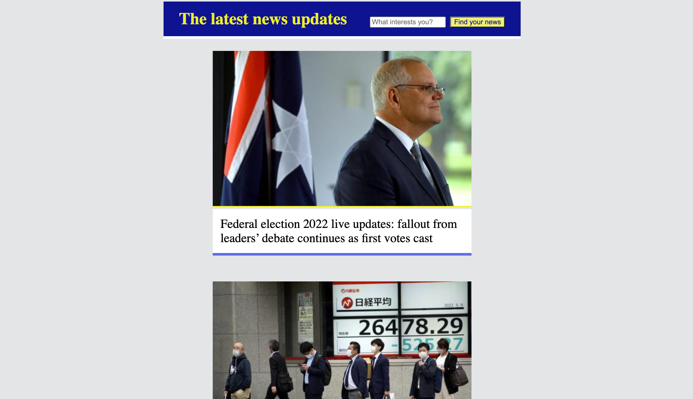

# News challenge

An app that shows the latest news using the Guardian API.

## Project overview

This app grabs all the headlines from the Guardian newspaper API and displays them on a
page. Clicking on a headline will link the user to the actual article page on the Guardian's website.

### Technologies

A single page web app. Code written in frontend JavaScript, CSS and HTML. Jest is used to write the tests. The [`jest-fetch-mock`](https://www.npmjs.com/package/jest-fetch-mock) module to mock `fetch` requests. `esbuild` to bundle files together.

### Getting set up

Fork this repo, then run `npm install`. My personal API key is not available, so in order to use this app, you'll need to [register and get an API
key](https://open-platform.theguardian.com/access/) to use the Guardian API. Then, in a file named 'apiKey.js'
in the main directory, write the following line:

`module.exports = "_your API key_"`

Run the app using `open index.html`


## Achieved User Stories

```
As a busy politician
So I know what the big stories of the day are
I can see all of today's headlines in one place
```

```
As a busy politician
So that I have something nice to look at
I can see a relevant picture to illustrate each news article when I browse headlines
```

```
As a busy politician
So I can get a few more details about an important story
I can click a news article title which links to the original article
```

```
As a busy politician
So I can search what I want to read about
I can specify a search query on the page and get articles matching this search
```

### Aspirational user stories

```
As a busy politician
Just in case my laptop breaks
I can read the site comfortably on my phone
```

```
As a busy politician
So I can quickly read through the essential of today's stories
I can see a summarised version of of the article 
```

```
As a busy politician
So I make my news reading more fun
I can see whizzy animations in the app
```

## Pages

### Headlines page



