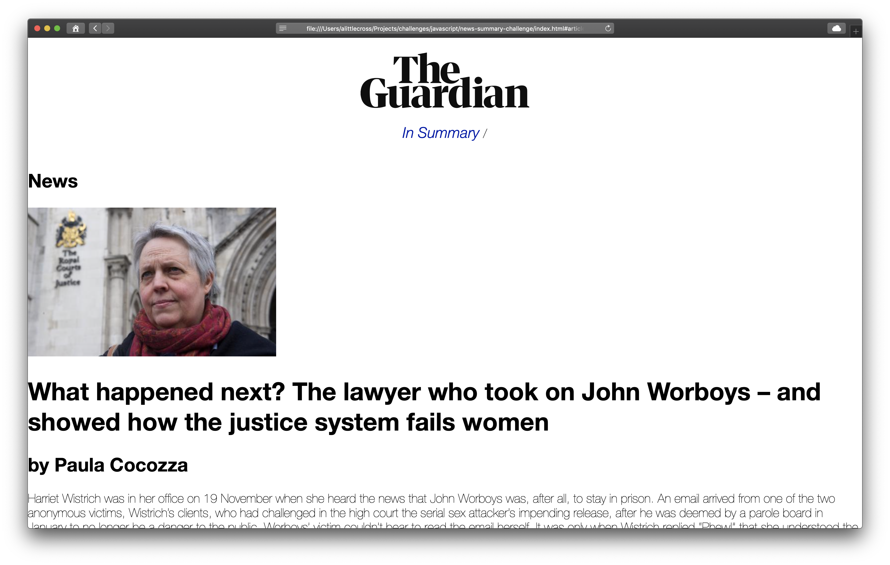
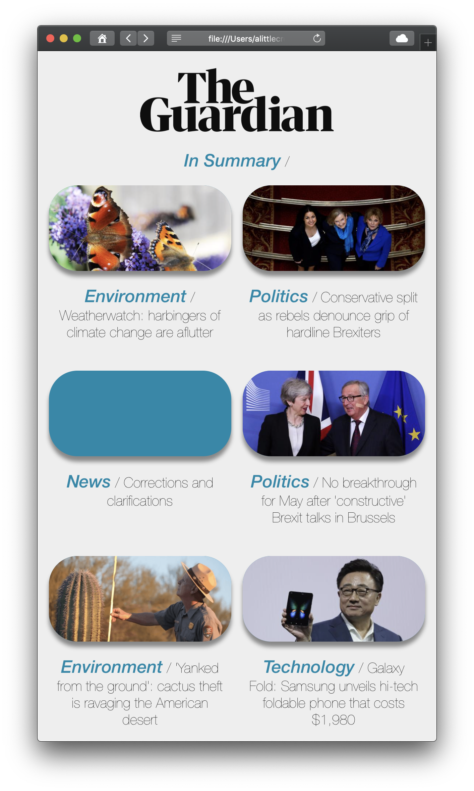

# News Summary Challenge

Makers Week 7 (Friday) - This challenge was to create a news summary web app using The Guardian API and build without frameworks, only JavaScript, html, and CSS.

## Getting Started

In the location of your choice, in Terminal:

`git clone git@github.com:alittlecross/news-summary-challenge.git`

`cd` into the `news-summary-challenge` folder.

Assuming you have Node.js and NPM installed, in that same location, in Terminal:

`npm install`

## Usage

(Note: The app the will only work if you save a Guardian API key in a file within the `news-summary-challenge` folder called `api-key.js`, like so: `var apiKey = "qwertyuiopasdfghjklzxcvbnm"`)

In that same location, in Terminal:

`./node_modules/.bin/http-server`

Then in the browser of your choice:

`http://localhost:8080/`

You should see article cards:

Clicking an article should show a larger image, a three paragraph summary of the story, along with a link to the full story:

The article cards and article summary views will adapt when viewed on a smartphone or tablet:

## Running tests

I used the test framework I wrote for my previous project, Spectrum.

To run the tests locally, in that same location, in Terminal:

`open Spectrum/Spectrum.html`

## Linting

In that same location, in Terminal:

`./node_modules/.bin/eslint src`
