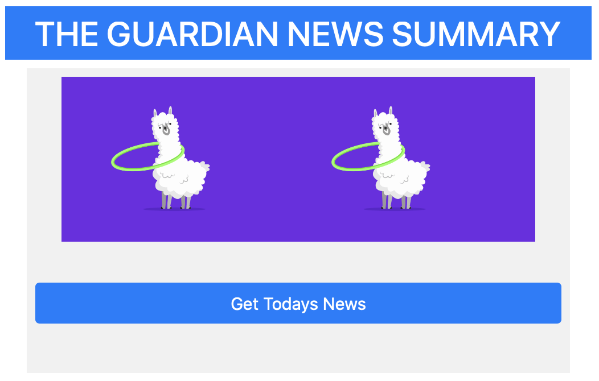

# News Summary challenge

[Project Description](#project-description) | [Tech Stack](#tech-stack) | [Installation](#installation) | [Running tests](#running-tests) | [Development Process](#development-process) | [User Stories](#user-stories) | [Models](#models) | [Further development](#further-development)

## Project Description

Create single page web app that will grab all the headlines from the Guardian newspaper API and display them on a page. By clicking on a headline will show a summary of the article.

## Tech Stack:

- **Custom Test Framework** for Javascript in the browser, loosely based on jasmine syntax. This was developed as part of an exercise while coding at Makers.
- **JavaScript (JS)** is a lightweight, interpreted, or just-in-time compiled programming language with first-class functions.
- **CSS or Cascading Style Sheets** is a style sheet language used for describing the presentation of a document written in a markup language like HTML.
- **HTML or Hypertext Markup Language** is the standard markup language for documents designed to be displayed in a web browser.

## Serving web app

Web app use a static web server (like [http-server](https://www.npmjs.com/package/http-server)) to serve HTML, CSS and JavaScript files. Web app sends requests to an API to get data from the Guardian and to summarize text.

## Installation

- Clone this repository
  `$ git clone https://github.com/EdAncerys/news-summary-challenge`
- Navigate to local repository
  `$ cd news-summary-challenge`
- Open index.html file in browser
  `$ open index.html`

## Running tests

- Navigate to local repository
  `$ cd news-summary-challenge/myTestFramework`
- Open myTestFramework.html file in browser
  `$ open myTestFramework.html`

## Development Process

During development process I used an agile development methodologies of using git, commit messages, git branches, merges and regular code refactor.

## User Stories

```
As a busy politician
I can see all of today's headlines in one place
So I know what the big stories of the day are
```

```
As a busy politician
I can click a link to see the original news article
So that I can get an in depth understanding of a very important story
```

```
As a busy politician
I can see a summary of a news article
So I can get a few more details about an important story
```

```
As a busy politician
I can see a picture to illustrate each news article when I browse headlines
So that I have something nice to look at
```

```
As a busy politician
I can read the site comfortably on my phone
Just in case my laptop breaks
```

```
As a busy politician
I can see whizzy animations in the app
To make my news reading more fun
```

## Models

| `News`    |
| :-------- |
| #newsBody |
| #preview  |

| `NewsData`        |
| :---------------- |
| #\_storedNewsData |
| #viewAllNews      |
| #getDataFromAPI   |

## Front page UI view

<p align="center">
    
</p>

## Further Development

Ideas to improve our application

- Front end UI redo with React.
- Expand on functionality and consider adding additional API for weather forecast etc.

## Code

If you're interested, you can see the code for the News Summary API in this repo: https://github.com/makersacademy/news-summary-api

## Resources

- [Guardian newspaper API homepage](http://open-platform.theguardian.com/documentation/)
- [Aylien text summary API docs](http://docs.aylien.com/docs/summarize)
- cURL [man page](https://curl.haxx.se/docs/manpage.html)
- [Hurl](https://www.hurl.it/), a web interface for sending HTTP requests
