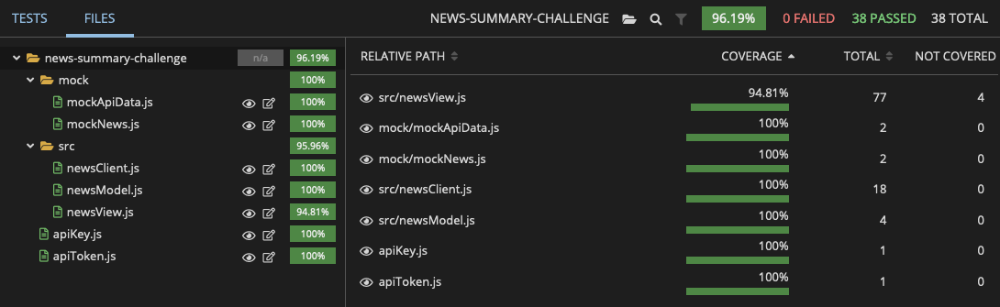

[](https://app.travis-ci.com/josephburgess/news-summary-challenge) 
# News challenge

## Introduction

Weekend challenge for the conclusion of week 7 at Makers Academy. The task was to create a single page newsreader web app. 

## Project overview

This app grabs all the headlines from the [Guardian's Open Platform API](https://open-platform.theguardian.com/) and displays them on a page. Clicking on an image will provide an overlay with a news summary generated by the [Pegasus Newsroom API](https://huggingface.co/google/pegasus-newsroom) which also then provides a link to the original story on the Guardian website. Clicking on the headline will also link the user to the original story.


## Features

- [x] User can see all of today's headlines in one place
- [x] User can filter by sections using links at the top of the page
- [x] User can see a relevant picture to illustrate each news article
- [x] A 'standfirst' summary of each article is shown alongside each story
- [x] Rolling over a story with the mouse cursor will trigger a zoom animation
- [x] Clicking on an image will provide an AI generated news summary in an overlay
- [x] Clicking a news article title links to the original article
- [x] Users can specify a search query on the page and get articles matching this search
- [x] Webpage is fully responsive and scales to screen size

## Technologies Used


- HTML
- CSS
- JavaScript
- `Node.js`
- `Jest`
- `esbuild`

## Installation Instructions

1. Clone this repo
2. Install dependencies with `npm install`
3. Sign up for a [Guardian Open Platform](https://huggingface.co/google/pegasus-newsroom) account to obtain an API key
4. Sign up for a [HuggingFace](https://huggingface.co/) account and obtain an API key
5. Add your API keys to the .env file in the repository and uncomment the lines
6. Use `npm run build` to run the bundler in watch mode.
7. Open the index.html file in your browser
8. Run tests with `npm test`.

## Test Coverage



## Issues

The AI generated news summary feature was a last-minute addition. Given the short window for development, this meant that implementation was not as efficient as it could have been. Summaries can be slow to load and temperamental if the user clicks a lot of images, and the overlays are not responsive in the same way as the main website. If redoing this challenge from scratch I would prefer to implement this functionality at the very start alongside the Guardian API. so that it could be more efficiently integrated.


## User Stories


```
As a busy politician
So I know what the big stories of the day are
I can see all of today's headlines in one place
```

```
As a busy politician
So that I have something nice to look at
I can see a relevant picture to illustrate each news article when I browse headlines
```

```
As a busy politician
So I can get a few more details about an important story
I can click a news article title which links to the original article
```

```
As a busy politician
So I can search what I want to read about
I can specify a search query on the page and get articles matching this search
```

### Stretch user stories

```
As a busy politician
So I can quickly read through the essential of today's stories
I can see a summarised version of of the article 
```

```
As a busy politician
Just in case my laptop breaks
I can read the site comfortably on my phone
```

```
As a busy politician
So I make my news reading more fun
I can see whizzy animations in the app
```

## Mockups

### Headlines page


### Article summary page


