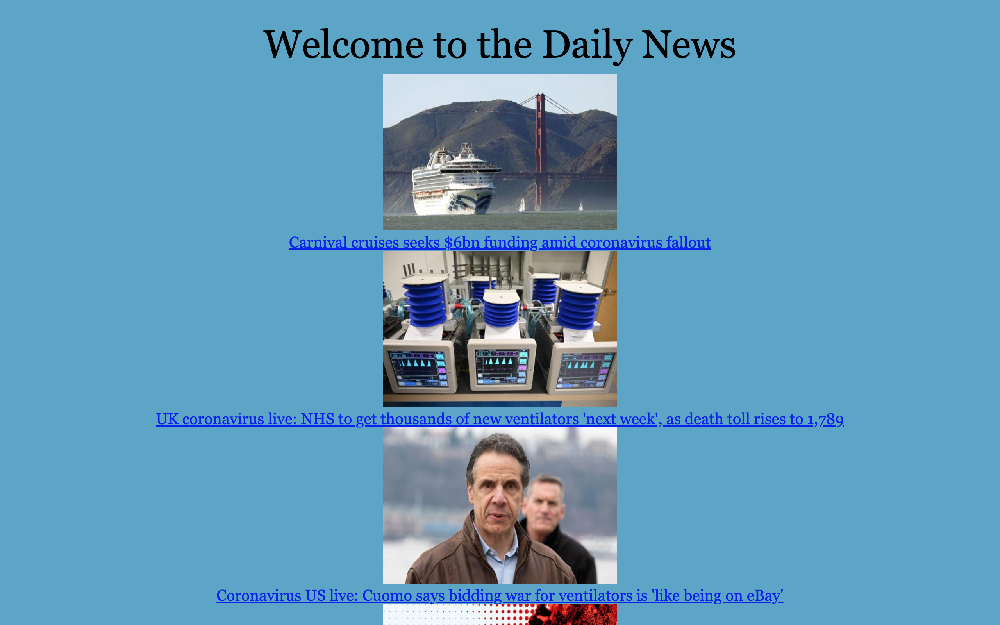
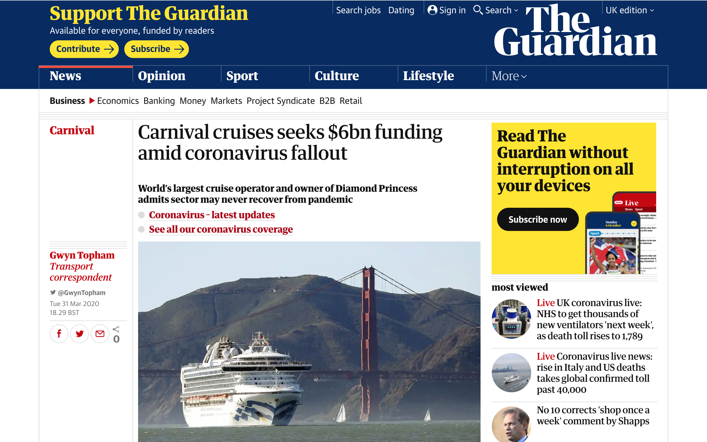

# New Summary

This was the seventh weekend challenge at Makers. It reinforced what I had learnt in the weeks work - working competently with, and building a front end web app in JavaScript. This apphas a 'serverless' architecture, as I only needed a static web server to run the app - the API is hosted on an external server.

I followed the brief when making this news app:

First, I focused on making clean code that was encapsulated, had a single responsibility and was DRY, all with a good file structure. Each object was injected into the corrosponding 'class' All of the code was test driven, using a library I had made myself.

I enjoyed this weekends challenge. I focused first of all on using the weeks afternoon challenge and refactoring it into a concise and DRY program with seperate .js files. I then focused on inheritance and injecting into each 'class' rather than instantiating new objects at each parent occurance. After building the basic framework, I then focused on breaking down the user stories and using the guardian API to access the information I needed.

---

## How to Run

Clone this repo, from the command line navigate to the [_news-summary-challenge_](news-summary-challenge) directory and in the command line type:

```
npm install
```

Once the dependancies are installed, Right click on the [_index_](index.html) file, click `copy path` and paste this into the Google Chrome browser to run the app. The top 10 articles currently on the Guardian site will appear.

### Testing

This App uses a test library I made myself, using the [_assert_](assert.js) function to test for truthyness. To check the test suite, right click, and click on `Inspect` to open up the Chrome Developer Tools. Click on the console tab at the top. Ypu will see 8 messages indicating the tests have passed.

---

## Brief

The app will grab headlines from the Guardian newspaper API and display them on a page. Clicking on a headline will show **a summary of the article.**

```
As a busy politician
I can see all of today's headlines in one place
So I know what the big stories of the day are
```

```
As a busy politician
I can click a link to see the original news article
So that I can get an in depth understanding of a very important story
```

```
As a busy politician
I can see a summary of a news article
So I can get a few more details about an important story
```

```
As a busy politician
I can see a picture to illustrate each news article when I browse headlines
So that I have something nice to look at
```

```
As a busy politician
I can read the site comfortably on my phone
Just in case my laptop breaks
```

---

#### Headline



#### Summary


#### Article


