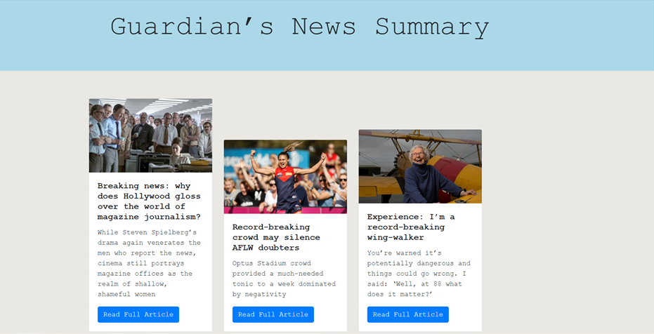
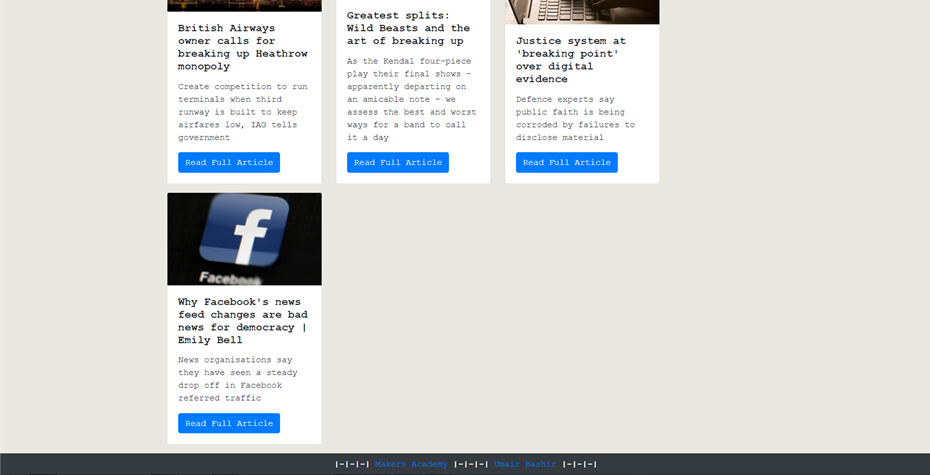
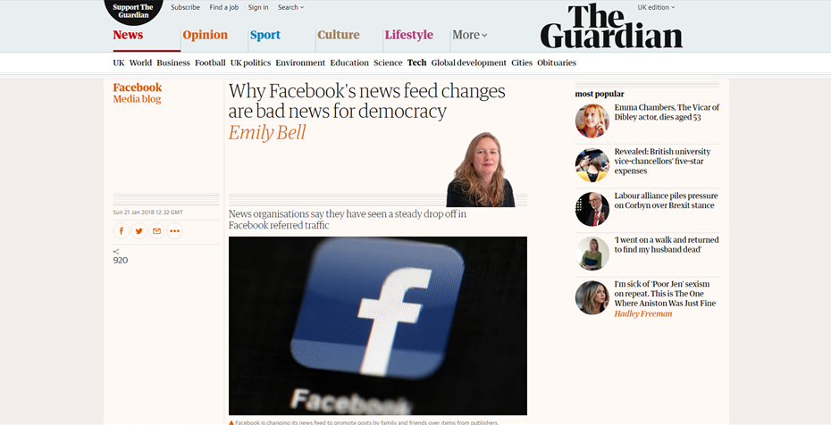

# News Summary challenge

A news api web app challenge set in the 7th week of Mackers Academy. The app uses an Express sever in the backend and pure javaScript in the frontend to send an AJAX request to the backend server. HTML and CSS/Bootstrap used to display the results of the api request.

## Technologies

**JavaScript**
- Express

**CSS**

- Bootstrap

**HTML**
##

## Setup

* Ensure that you have [Node.js](https://nodejs.org/en/download/) installed
* Clone the repo from the github pagg

* Navigate to the folder and install dependencies using:

`npm install`


## User Stories

```
As a busy politician
I can see all of today's headlines in one place
So I know what the big stories of the day are
```

```
As a busy politician
I can click a link to see the original news article
So that I can get an in depth understanding of a very important story
```

```
As a busy politician
I can see a summary of a news article
So I can get a few more details about an important story
```

```
As a busy politician
I can see a picture to illustrate each news article when I browse headlines
So that I have something nice to look at
```

```
As a busy politician
I can read the site comfortably on my phone
Just in case my laptop breaks
```

```
As a busy politician
I can see whizzy animations in the app
To make my news reading more fun
```
## Screenshots







