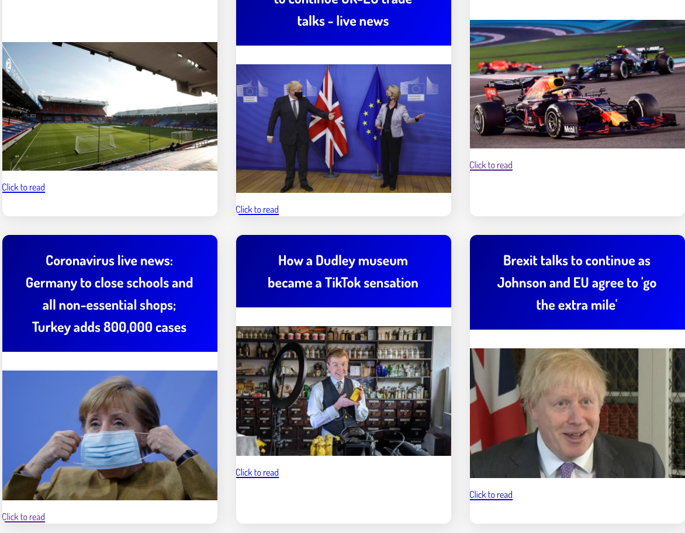
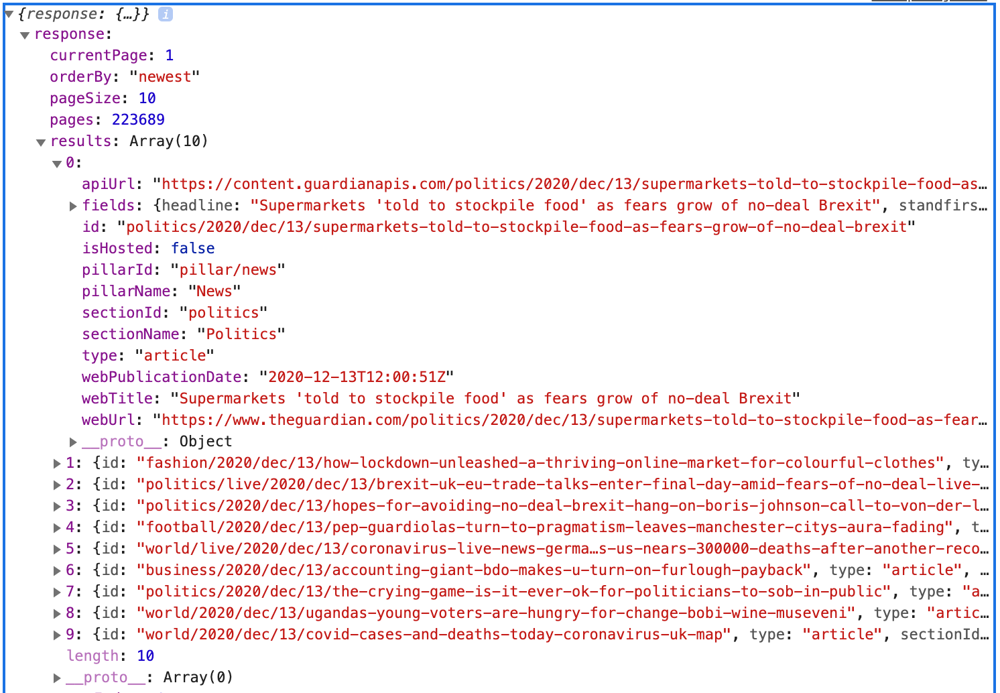

# News Summary challenge


## Project overview

This app will grab all the headlines from the Guardian newspaper API and display them on a page.  Clicking on a headline will take you directly to the article.

### Technologies

For this single page web app I've written my code in frontend JavaScript, CSS and HTML. And, as is the theme for this week, I didn't use any libraries or frameworks!


## My Process

I wanted to understand APIs and how to use the JavaScript Fetch API to get data. The first time I used an API was with the Thermostat challenge the previous week and we had been provided with a walkthrough to guide us. This time, I relied on this fantastic [tutorial](https://www.taniarascia.com/how-to-connect-to-an-api-with-javascript/) I found online. Whilst it used XMLHttpRequest I was able to adapt it with the help of other [articles](https://www.digitalocean.com/community/tutorials/how-to-use-the-javascript-fetch-api-to-get-data), and Alice's workshop.

Thanks to the knowledge sharing in my close-knit cohort the big tip was to add `&show-fields=all` at the end of the [API](https://open-platform.theguardian.com/access/) to get the thumbnail and headline. See picture below. 

I used a static web server (e.g. [http-server](https://www.npmjs.com/package/http-server)) to serve my HTML, CSS and JavaScript files.  

## User Stories


```
As a busy politician
I can see all of today's headlines in one place
So I know what the big stories of the day are
```

```
As a busy politician
I can see a relevant picture to illustrate each news article when I browse headlines
So that I have something nice to look at
```


