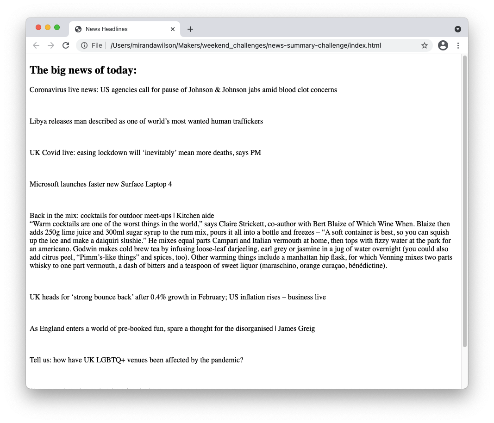

## News Summary

A Single Page App that shows the most recent news articles from [The Guardian](https://www.theguardian.com/uk), with a summary for each article.

### Description
This was the final weekend challenge for the [Makers Academy](https://makers.tech) coding bootcamp. The goal was to practise API calls, vanilla JavaScript, and Single Page Apps.

We were given these user stories:
```
As a busy politician
I can see all of today's headlines in one place
So I know what the big stories of the day are
```
```
As a busy politician
I can see a relevant picture to illustrate each news article when I browse headlines
So that I have something nice to look at
```
```
As a busy politician
I can click a news headline to see a summary and a photo of the news article
So that I can get an in depth understanding of a very important story
```
```
As a busy politician
I can see click a news article summary title which links to the original article
So I can get a few more details about an important story
```
```
As a busy politician
I can read the site comfortably on my phone
Just in case my laptop breaks
```
```
As a busy politician
I can see whizzy animations in the app
To make my news reading more fun
```

The news articles were obtained using [The Guardian API](https://open-platform.theguardian.com/documentation/). The Guardian is a centre-left/liberal newspaper in the UK. The article summaries were generated via [Aylien API](https://docs.aylien.com/). Makers provided us with an API to manage both of these so that we didn't have to worry about API keys (the Aylien API is no longer available for new sign-ups).

I completed the first of the user stories, and part of the third: the page shows the titles of the ten most recent articles from The Guardian. Clicking on a title reveals the summary of that article.

It looks like this:




### Installation and Usage
* Clone this repo
* Navigate to the cloned folder
* Open `index.html` in Chrome browser

### Known Issues
* The page doesn't work properly in Firefox.
* Clicking on the article title more than once causes the summary to appear multiple times. There's currently no way to hide the summaries.
* There are no tests.


