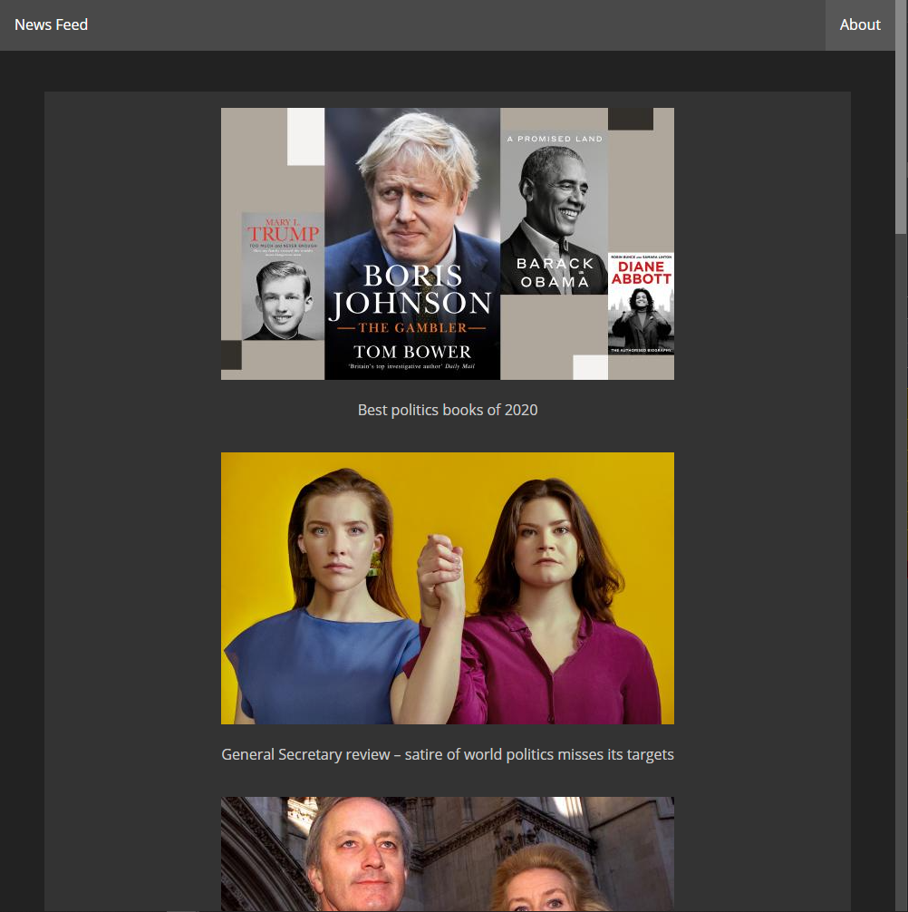
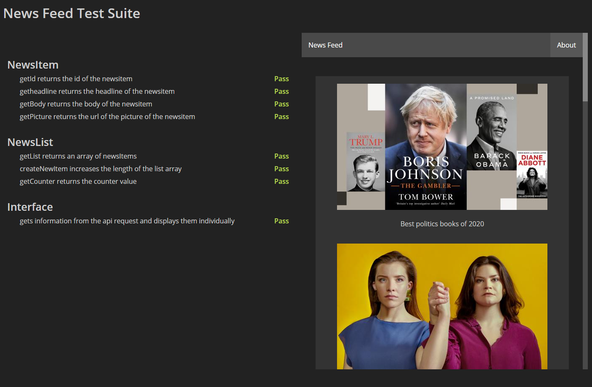

# News Summary

- A single page web app written in vanilla JavaScript, html and CSS. It makes use of the [Guardian open platform API](https://open-platform.theguardian.com/documentation/) to get articles and display them responsively.

- If you clone this repo, the first time the page is run it will make an API request which will then be stored in local data, this is then used for subsequent calls as to not swamp the Guardian API.

- To serve the page, I have used [live-server](https://ritwickdey.github.io/vscode-live-server/) on [VScode](https://code.visualstudio.com/). If you have that installed you can simply right click open with live server on `index.html` or `testRunner.html`.

- There is a small testing library, it does equality matching only, with two methods solely to test arrays for equality dependant of contents. 

- When clicking on an article image or title it reveals the article in full with a accordion animation.

## On a web browser

## The testRunner.html showing testing outcomes
