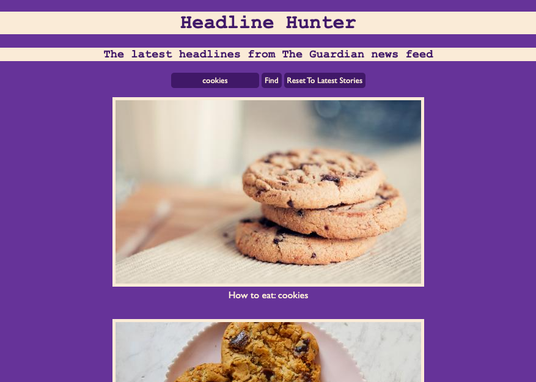

## News Summary Challenge

This is the Makers week 7 weekend challenge. The goal was to create an app that shows the latest news using the Guardian API.
Further details of the challenge can be found in the CHALLENGE.md file.

## Successes

- It looks nice

- The search function works

- All tests passing with 100% coverage

- All basic user stories met 
