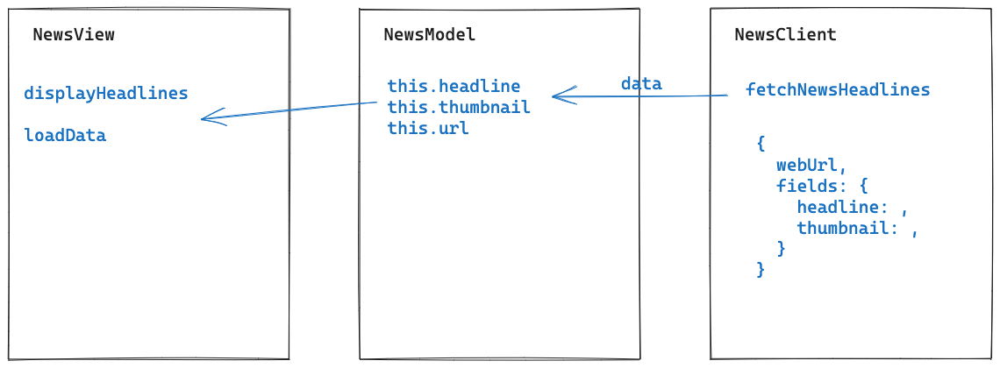

# News challenge

## Project overview

Your app will grab all the headlines from the Guardian newspaper API and display them on a page. Clicking on a headline will link the user to the actual article page on the Guardian's website.

### Technologies

For this challenge I will create a single page web app.

- HTML
- CSS
- JavaScript
- Jest (including jest-fetch-mock and jest-environment-jsdom)
- esbuild

### Installation

To install this application locally you'll need to [register and get an API key](https://open-platform.theguardian.com/access/) to use the Guardian API.'

```plain
$ git clone https://github.com/sarahc-dev/news-summary-challenge.git
$ cd news-summary-challenge
$ npm install
$ echo "module.exports = '<YOUR API KEY>'" >> apiKey.js
$ npm run build
```

## User Stories

```plain
As a busy politician
So I know what the big stories of the day are
I can see all of today's headlines in one place
```

```plain
As a busy politician
So that I have something nice to look at
I can see a relevant picture to illustrate each news article when I browse headlines
```

```plain
As a busy politician
So I can get a few more details about an important story
I can click a news article title which links to the original article
```

```plain
As a busy politician
So I can search what I want to read about
I can specify a search query on the page and get articles matching this search
```

### Stretch user stories

```plain
As a busy politician
So I can quickly read through the essential of today's stories
I can see a summarised version of of the article
```

To get a summary of an article's content, you'll need to use the [Aylien API
endpoint](https://docs.aylien.com/textapi/endpoints/#summarization), which means
integrating and calling another HTTP endpoint from a different API. This mean you'll need
to first fetch articles from the Guardian API, **then** use the Aylien API to summarise
the content — you'll need to use promises or callbacks to call both APIs and to handle the flow of
control.

```plain
As a busy politician
Just in case my laptop breaks
I can read the site comfortably on my phone
```

```plain
As a busy politician
So I make my news reading more fun
I can see whizzy animations in the app
```

## Diagram

This is my original diagram. During development, I changed the NewsModel to contain an array of news items, instead of it being a single news item.



## Mockups

### Headlines page


### Article summary page


## API

### API authentication

You'll need to [register and get an API
key](https://open-platform.theguardian.com/access/) to use the Guardian API.

### API request rate limits and stubbing

The Guardian API is severely rate-limited.

**Please stub your tests so we don't exceed the daily limit. Otherwise, all requests will
be rejected and everyone's apps will stop working!**

## Guardian API Overview

**Remember to mock `fetch` in your tests to avoid exceeding the API rate limit**

If you wanted to get the latest articles from the Guardian API, this is the cURL request
you might make. Notice how it has a query parameter for `api-key`.

```plain
curl "https://content.guardianapis.com/search?q=&query-fields=headline&show-fields=thumbnail,headline,byline&order-by=newest&api-key=test"
```

Also notice that the URL parameter `q` is empty — we can pass in a search string to filter
the returned articles, for example to search articles containing "America" in the title:

```plain
curl "https://content.guardianapis.com/search?q=America&query-fields=headline&show-fields=thumbnail,headline,byline&order-by=newest&api-key=test"
```

The above request will return a response similar to this one:

```json
{
  "response": {
    "status": "ok",
    "userTier": "developer",
    "total": 2324223,
    "startIndex": 1,
    "pageSize": 10,
    "currentPage": 1,
    "pages": 232423,
    "orderBy": "newest",
    "results": [
      {
        "id": "sport/blog/2022/feb/02/at-last-the-inventors-of-modern-skiing-have-something-to-cheer-dave-ryding",
        "type": "article",
        "sectionId": "sport",
        "sectionName": "Sport",
        "webPublicationDate": "2022-02-02T14:42:43Z",
        "webTitle": "At last, the inventors of modern skiing have something to cheer: Dave Ryding | Andy Bull",
        "webUrl": "https://www.theguardian.com/sport/blog/2022/feb/02/at-last-the-inventors-of-modern-skiing-have-something-to-cheer-dave-ryding",
        "apiUrl": "https://content.guardianapis.com/sport/blog/2022/feb/02/at-last-the-inventors-of-modern-skiing-have-something-to-cheer-dave-ryding",
        "fields": {
          "headline": "At last, the inventors of modern skiing have something to cheer: Dave Ryding ",
          "byline": "Andy Bull",
          "thumbnail": "https://media.guim.co.uk/1e2ab1ced5da6ecf8d7fcca9f87d5398c1d22336/0_119_6480_3888/500.jpg"
        },
        "isHosted": false,
        "pillarId": "pillar/sport",
        "pillarName": "Sport"
      },
      {
        "id": "business/live/2022/feb/02/oil-prices-climb-seven-year-highs-opec-meeting-markets-await-eurozone-inflation",
        "type": "liveblog",
        "sectionId": "business",
        "sectionName": "Business",
        "webPublicationDate": "2022-02-02T14:41:49Z",
        "webTitle": "Ofgem to unveil new household energy bill price cap on Thursday morning – business live",
        "webUrl": "https://www.theguardian.com/business/live/2022/feb/02/oil-prices-climb-seven-year-highs-opec-meeting-markets-await-eurozone-inflation",
        "apiUrl": "https://content.guardianapis.com/business/live/2022/feb/02/oil-prices-climb-seven-year-highs-opec-meeting-markets-await-eurozone-inflation",
        "fields": {
          "headline": "Ofgem to unveil new household energy bill price cap on Thursday morning – business live",
          "byline": "Julia Kollewe",
          "thumbnail": "https://media.guim.co.uk/aee3b3b05ea2a37acdadc91095c163fd381eba4a/0_24_3500_2100/500.jpg"
        },
        "isHosted": false,
        "pillarId": "pillar/news",
        "pillarName": "News"
      }
      // ...
    ]
  }
}
```

## Resources

- [Guardian newspaper API homepage](http://open-platform.theguardian.com/documentation/)
- cURL [man page](https://curl.haxx.se/docs/manpage.html)
- [Postman](https://www.postman.com/downloads/?utm_source=postman-home), a program to send and test HTTP requests
