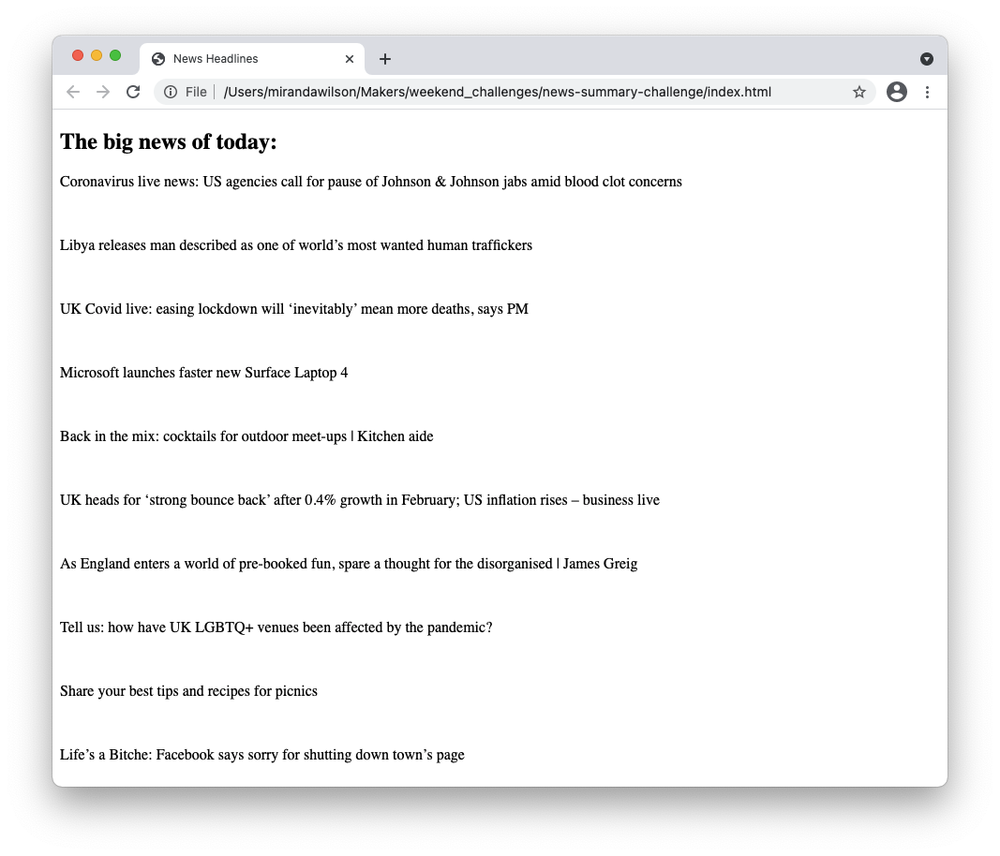

# News Summary challenge
Welcome to the News Summary app. This app gives you the top stories for today.

### How to Run the Program:
* Clone this repo `git clone https://github.com/Caitlin-cooling/notes-SPA.git`
* `cd news-summary-challenge`
* To start the HTTP-Server use command `node node_modules/http-server/bin/http-server`
* You can then see in the app in your browser if you visit `localhost:8080`

This will load the news headlines from the Guardian API. Click on a headline to see the story.

### How to Run the Tests:
The testing framework was written by myself and Imtyaz this week. It can be found in `spec/framework.js`.

Run the tests by opening `specRunner.html` in your browser. You will need to open the console to see the outcome. Please note that the Guardian API is stubbed in the tests.

Note that if you are adding tests they will need to be included in the `specRunner.html` to be run.

### Dependancies
This app relies on an HTTP-Server and the Guardian API.

### My Approach to Solving this Challenge
To begin I diagrammed how I expected the code to interact. I then test drove the JavaScript code to show the stories on the page.

I styled the pieces once I had finished a feature to make it easier to see what was actually going on on my page.

I then plugged the Guardian API in to the code that I had. I found that I had to then change a few pieces of code such as taking a URL for a story rather than the content.
