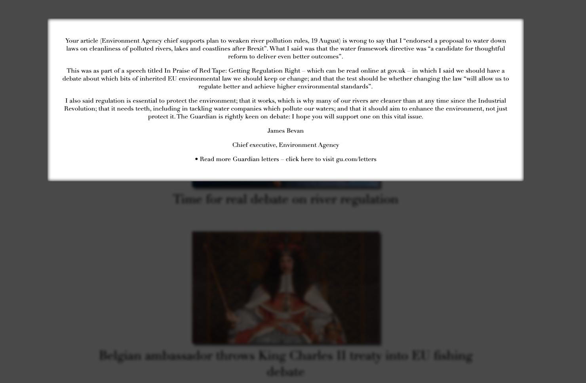
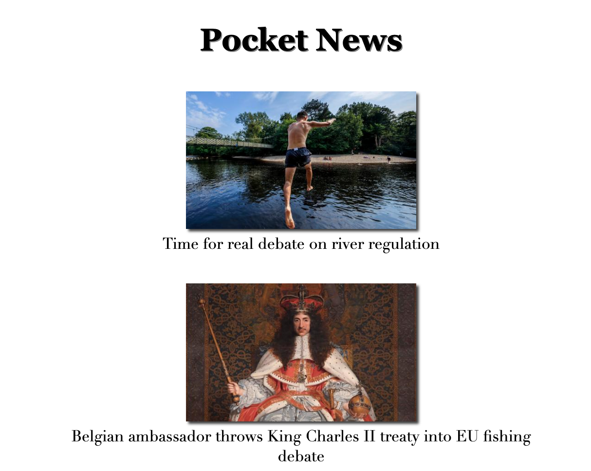

# News Summary challenge

Week 7 - weekend challenge building a front end web app using only Javascript, HTML and CSS.  
The app fetches the latest news stories from the Guardian API and returns the latest ten headlines.  
Click on a headline to visit the full story on the Guardian website, or click the image for a popup summary.


## User Stories Implemented

```
User Story 1
As a busy politician
I can see all of today's headlines in one place
So I know what the big stories of the day are
```

```
User Story 2
As a busy politician
I can click a link to see the original news article
So that I can get an in depth understanding of a very important story
```

```
User Story 3
As a busy politician
I can see a summary of a news article
So I can get a few more details about an important story
```

```
User Story 4
As a busy politician
I can read the site comfortably on my phone
Just in case my laptop breaks
```

```
As a busy politician
I can see a picture to illustrate each news article when I browse headlines
So that I have something nice to look at
```

## SetUp

Start by cloning this repo

    git clone https://github.com/TheDancingClown/news-summary-challenge.git

Install http-server to run locally. Follow the instructions [here](https://www.npmjs.com/package/http-server) or

    brew install http-server

Navigate to the repo folder and start the server

    http-server './'

Visit [http://127.0.0.1:8080/](http://127.0.0.1:8080/) in your browser.

## Frameworks and Tools Used

* Javascript
* HTML & CSS
* [http-server](https://www.npmjs.com/package/http-server)
* [Makers News Summary API](https://github.com/makersacademy/news-summary-api)
