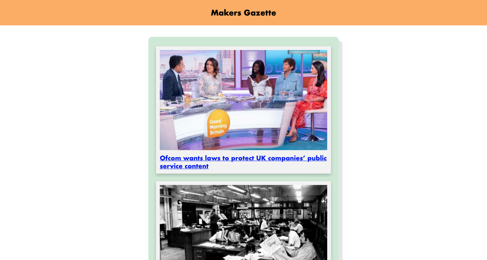

# News Summary challenge



## INTRODUCTION

I undertook this project to challenge my understanding of how to create a single page web app with vanilla JavaScript, CSS and HTML. I have avoided the use of any backend JavaScript and Ruby.

The app grabs all the headlines from the Guardian newspaper API and displays them on a page, clicking on a headline will show a summary of the relevant article.


## GETTING STARTED

* `git clone` the repo.
* Go to the project root with `cd news-summary-challenge`.
* Run `node node_modules/http-server/bin/http-server`. This allows you to run a local server from the command line.
* Visit [The Guardian Open Platform](https://open-platform.theguardian.com/) and apply for an API key.
* Input your new API key into the config_EXAMPLE.js file and rename it `config.js`.
* You will now be able to run the app in your default browser by running `open index.html`.

## HOW TO USE THE APP

1. You can scroll the homepage and click on a link that you like.

2. When you've finished reading your article you can click the 'BACK' button to return to the homepage.

## USER STORIES

Here are the user stories the Makers Academy provided for the challenge. I was able to implement all but the final user story (asking for 'whizzy animations') before running out of time.

```
As a busy politician
I can see all of today's headlines in one place
So I know what the big stories of the day are

As a busy politician
I can click a link to see the original news article
So that I can get an in depth understanding of a very important story

As a busy politician
I can see a summary of a news article
So I can get a few more details about an important story

As a busy politician
I can see a picture to illustrate each news article when I browse headlines
So that I have something nice to look at

As a busy politician
I can read the site comfortably on my phone
Just in case my laptop breaks

As a busy politician
I can see whizzy animations in the app
To make my news reading more fun
```

## TECH/FRAMEWORK USED

**Primary programming language:** *JavaScript*

**Other programming languages:** *HTML* and *CSS*

## TESTING

Here's where I became unstuck. The app relies on only the testing framework included in Google DevTools. Due to the time constraint I wanted to focus on the mechanics of the code as opposed to structuring a reliable testing framework. In hindsight I would have used the framework we had developed in the previous week during my [notes_js](https://github.com/marbuthnott/notes_js) project, and possibly implement some of the thinking in this useful [blog](https://medium.com/@giltayar/testing-your-frontend-code-part-i-introduction-7e307eac4446).

## APPROACH

The controller is the `interface.js` which hold the function that looks for a hash change in the url. Depending on the state of the hash change it will either render the summary article view or the headline list view.

The largest learning curve was linking the Guardian API to the app. How to request the data and understanding the state in which it was returned was (for an API newbie) challenging. I created a separate file to handle all the interaction with the Guardian API, it I had more time I would try and make it more descriptive so users of the code could understand what each line is doing.

Finally I created an `src` directory to hold the functions to render the two views. This was a case of playing with the various elements HTML `display` characteristic and also creating a loop to display all headlines within the API. While it has functionality the code quality within the files is poor and could do with significant refactoring (again I had run out of time).

## WHAT I WOULD HAVE DONE DIFFERENTLY

I was only just able to complete this project in the allocated 2 day time limit, and so had to cut short my refactoring.

In order to improve this project I would focus on the view rendering files. I would create separate methods to handle the 'hiding' of elements and another to 'show' elements. There is also scope to tidy the code within the `headlineList.js` file, and in particular the HTML code for each list element; most likely this would be in the form of a private function to handle producing the HTML code for an individual list item.
