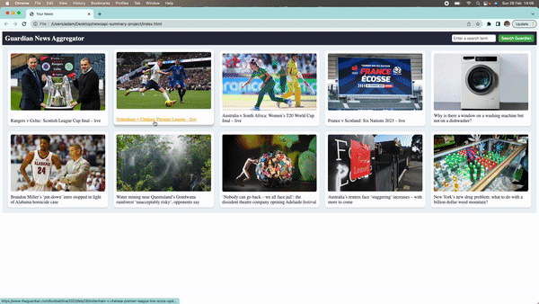
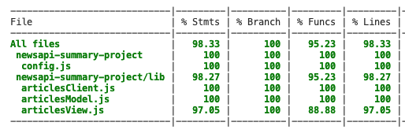

# News challenge

## Introduction

Weekend challenge to create a single page web app that makes API calls to the Guardian News API and displays the results.

## Technologies Used

	<code></code>
	<code></code>
	<code></code>
	<code></code>
	<code></code>

## Project Overview

On loading this app displays the 10 most recent articles publish to the [Guardian News API](https://open-platform.theguardian.com/). From there each you are able to click on each link to take you through to the article.

There is search functionality in the top right of the page that allows the user to search by a topic. In the demo video below you can see it returns the ten most recent searches for "Sports" related articles.

Addtionally, the page is responsive to the screensize or window resizing.

## Planning

When given the project brief for this project my approach was to breakdown the user stories into their Nouns and Verbs, relate those into Classes or Functions/Features and from there create a mock up of what I was aiming for.

This helped me to think through the process, look ahead for any potential issues and gave me a high leve of plan of how to begin the TDD process.

## Features

- User can view the most recent headlines on one page
- User can search stories based on a topic of interest
- Each story displays its corresponding image
- Webpage is fully responsive to screensize
- Hover over an image provides a small animation
- Clicking the article takes the user to the story

## Installation Instructions

1. Clone this rep
2. Install dependencies using `npm install`
3. Sign up for the [Guardian News API](https://open-platform.theguardian.com/) to generate an API key.
4. Create a config.js file
5. Add your API key in `const apiKey = {apiKey :"API KEY HERE"};` and export this with `module.exports = apiKey;`
6. Enter `npm run build` in your terminal
7. Enter `open index.html` in a separate terminal

This will open the site in your browser

## Test Coverage

## Future Actions

- Get the test coverage for the View class to 100%
- Display the first few lines of each article when the user hovers on the tile
- Add additional search parameters like dates or specific words to find within articles

## User Stories

1. As a busy politician 
   So I know what the big stories of the day are 
   I can see all of today's headlines in one place

2. As a busy politician 
   So that I have something nice to look at 
   I can see a relevant picture to illustrate each news article when I browse headlines 

3. As a busy politician 
   So I can get a few more details about an important story 
   I can click a news article title which links to the original article 

4. As a busy politician 
   So I can search what I want to read about 
   I can specify a search query on the page and get articles matching this search 

## Stretch User Stories

1. As a busy politician 
   So I can quickly read through the essential of today's stories 
   I can see a summarised version of of the article  

2. As a busy politician 
   Just in case my laptop breaks 
   I can read the site comfortably on my phone 

3. As a busy politician 
   So I make my news reading more fun 
   I can see whizzy animations in the app 
