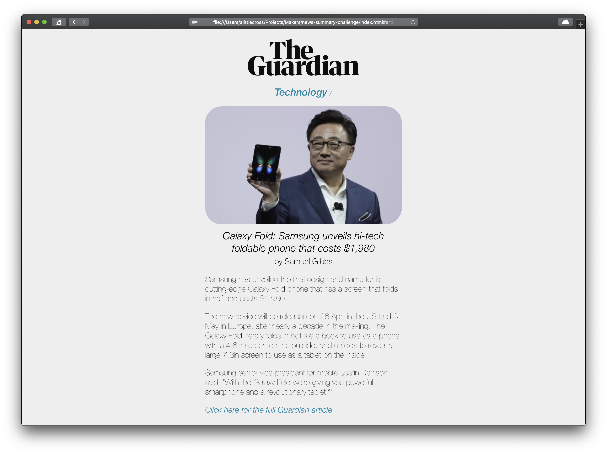

# News Summary Challenge

This challenge was to create a news summary web app build with only JavaScript, html, and CSS.

To try out the app, clone this repo:

```git clone git@github.com:alittlecross/bowling-challenge.git```

And run `index.html` from that folder.

HOWEVER - the will only work if you save a Guardian API key in a file within that folder call `api-key.js`, like so:

```var apiKey = "qwertyuiopasdfghjklzxcvbnm";```

## Screenshots ##

When running, when viewing the homepage, it should look like this in browser:


And like this on a mobile:


When viewing an article summary, it should look like this in browser:



And like this on a mobile:


## Testing ##

All code has been testing with my own testing framework, Spectrum.

In the repo that you cloned, run `Spectrum.html` from the `Spectrum` folder.

## User Stories

```
As a busy politician
I can see all of today's headlines in one place
So I know what the big stories of the day are
```

```
As a busy politician
I can click a link to see the original news article
So that I can get an in depth understanding of a very important story
```

```
As a busy politician
I can see a summary of a news article
So I can get a few more details about an important story
```

```
As a busy politician
I can see a picture to illustrate each news article when I browse headlines
So that I have something nice to look at
```

```
As a busy politician
I can read the site comfortably on my phone
Just in case my laptop breaks
```

```
As a busy politician
I can see whizzy animations in the app
To make my news reading more fun
```
