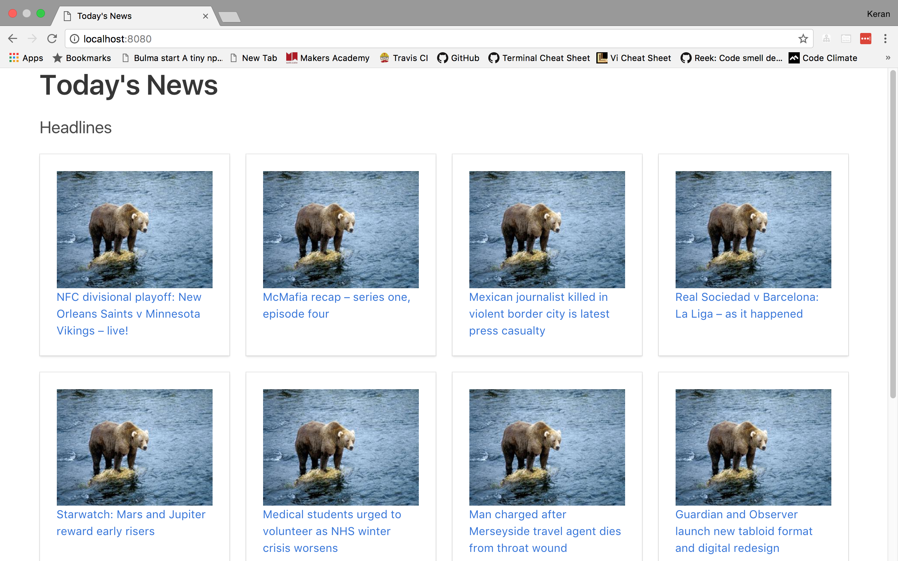

# News Summary challenge

This app grabs headlines from the Guardian newspaper API and displays them on a page. Users can view the original news article by clicking on the headline's link.

## User stories

User Story 1

```
As a busy politician
I can see all of today's headlines in one place
So I know what the big stories of the day are
```

User Story 2

```
As a busy politician
I can click a link to see the original news article
So that I can get an in depth understanding of a very important story
```

User Story 3

```
As a busy politician
I can see a summary of a news article
So I can get a few more details about an important story
```

User Story 4

```
As a busy politician
I can see a picture to illustrate each news article when I browse headlines
So that I have something nice to look at
```

User Story 5

```
As a busy politician
I can read the site comfortably on my phone
Just in case my laptop breaks
```

User Story 6

```
As a busy politician
I can see whizzy animations in the app
To make my news reading more fun
```

## Getting started

These instructions will get you a copy of the project up and running on your local machine for development and testing purposes.

### Installing

Clone the program to your local directory:

```
git clone https://github.com/ker-an/news-summary-challenge.git
cd news-summary-challenge
```

Ensure both node and npm are installed:

```
node -v
npm -v
```

Install http-server:

```
npm install http-server --save
```

Run to view index.html page:

```
node node_modules/http-server/bin/http-server
```

## How to use

Headlines from the Guardian newspaper are displayed:



Webpage can be comfortably read from a mobile:


Click on a link to be view original news article:


## Built with

```
JavaScript(ES5)
Guardian API
Makers News Summary API
```

## Final thoughts

I approached this project in a similar way to the Notes app and was able to complete User Story 1, 2 and 5. Although I was unable to finish the app, I gained an understanding of the Model-View-Controller relationship, XMLHttpRequest objects, and APIs. If I had more time, I would have used the Aylien API to display a summary and photograph from each article, with each article's link. I plan on returning to this project at another time to incorporate these features.

## Author

[Keran Braich](https://github.com/ker-an)
