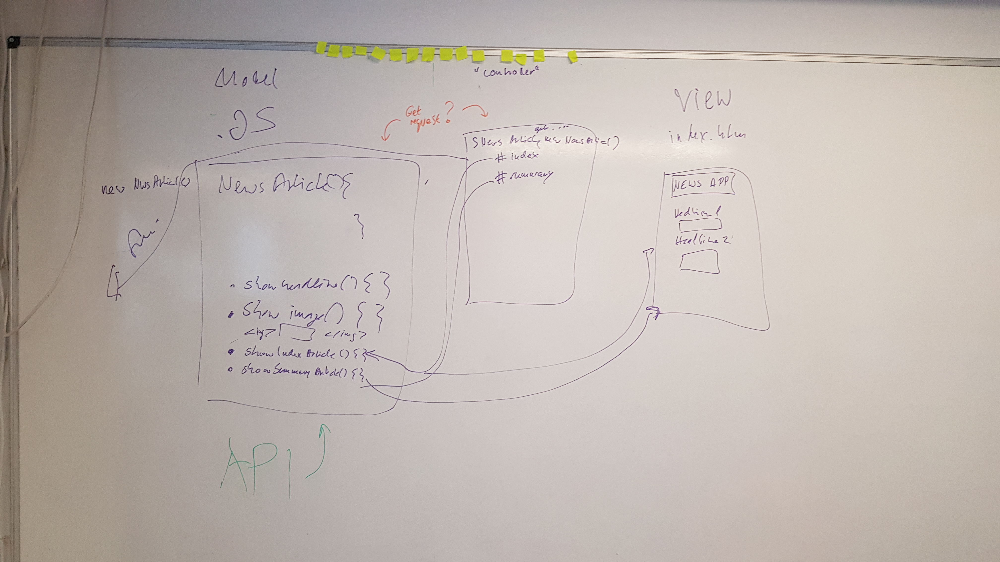

# News Summary challenge

* Makers Academy challenge to build a Single Page News App

## Project overview

The app grabs news article information from the Guardian newspaper API and display them on a page.  The landing page shows the headlines and images of 10 news articles.  Clicking on a headlines shows the full text of the article.  Clicking on the 'show article summary' button next to an artile will display a summary of this article.  The 'full article view' can be reached from the 'article summary view' and vice versa, and both views allow the user to go back to the initial article list. 

### Technologies

This is written as a single page web app.  The code is written in frontend JavaScript, CSS and HTML.  It uses no frameworks or libraries. 
It uses the Aylien API to summarise text, and the Guardian API to query news articles.

The app use a static web server ([http-server](https://www.npmjs.com/package/http-server)) to serve the HTML, CSS and JavaScript files.  Requests are sent to an API to get data from the Guardian and to summarise text.

### Using the app at home

**The app currently uses static data to render the news article views, stored in data.json, to minimise requests to the Guardian API.  If you want to use live data, change 'let url' in 'APIQuery.js'**

```
$ git clone https://github.com/fbl11/news-summary-challenge
$ cd news-summary-challenge
$ npm install
$ node_modules/http-server/bin/http-server -o

STATUS
-----
Implements article listing, summary view and full view.

**Notes*
* The entire app is currently untested.
* The a*pp does not have any styling.
* The article summary is currently created by passing the article url to the Aylien API.  I would prefer to use the full article text (which is returned by the Guardian API and which I'm using to display the full article) to create the summary instead of the external link, but have not yet been able to implement.

**TO DO**

- Add tests
- Use body text to create article summaries instead of Guardian url
- Add styling
- Add up-to-date domain model

## Domain Model


## User Stories

Some of these stories will need decomposing if they seem too large.

```
As a busy politician
I can see all of today's headlines in one place
So I know what the big stories of the day are
```

```
As a busy politician
I can click a link to see the original news article
So that I can get an in depth understanding of a very important story
```

```
As a busy politician
I can see a summary of a news article
So I can get a few more details about an important story
```

```
As a busy politician
I can see a picture to illustrate each news article when I browse headlines
So that I have something nice to look at
```

```
As a busy politician
I can read the site comfortably on my phone
Just in case my laptop breaks
```

```
As a busy politician
I can see whizzy animations in the app
To make my news reading more fun
```

## Resources

* [Guardian newspaper API homepage](http://open-platform.theguardian.com/documentation/)
* [Aylien text summary API docs](http://docs.aylien.com/docs/summarize)

Author
-----
Freya Becker [fbl11](https://github.com/fbl11/)