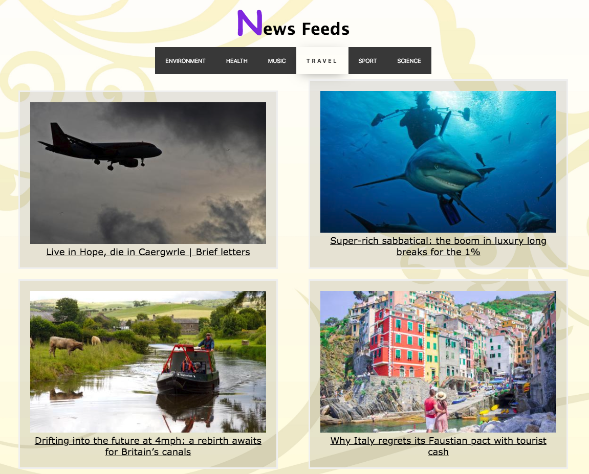

# News Summary challenge 

This repository is a Javascript implementation of a News Feed app using the Model-View-Controller (MVC) architecture pattern. The basic understanding of the MVC model can be found [here](https://developer.mozilla.org/en-US/docs/Web/Apps/Fundamentals/Modern_web_app_architecture/MVC_architecture).

### Sequence Diagram
The News Feed app should send request and receive response as follow:
 

## Usage

### Installation  

This app runs on Javascript, and uses Node.js to manage dependencies. To install Node.js follow the instructions [here](https://nodejs.org/en/). To run the app just open the `index.html` page. News parameters can be selected on the menu bar. The default parameter is 'politics' to comply with the [user story](https://github.com/EllyChanx/news-summary-challenge/blob/master/INSTRUCTION.md), but it is not on the menu bar because I don't want to.

**Default News Type (politics):**

**Travel:**

### Linting Utility

Linting is performed with [ESLint](https://eslint.org/) to analyse potential errors and to maintain code conform. All codes in `src` folder and `spec` folder are linted for code readability. 