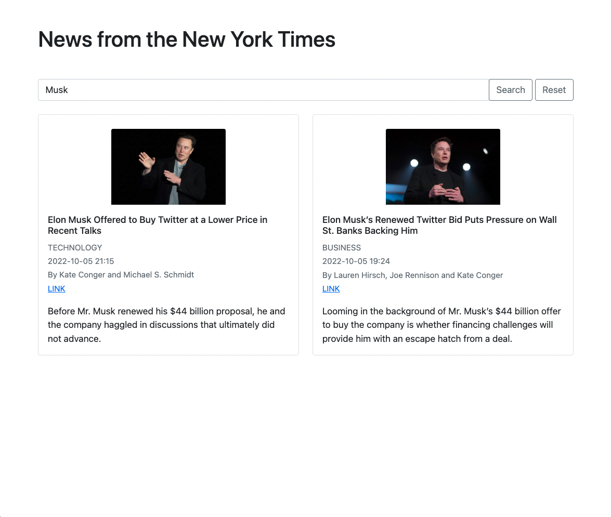

## News from the New York Times

A single page web-app showing latest news from the New York Times.

## Technologies

- The app is written in Typescript
- It uses the [New York Times Top Stories API](https://developer.nytimes.com/docs/top-stories-product/1/overview)
- It uses the `http-server` npm package to run the server on localhost:8080
- It uses Bootstrap for CSS

## How to use

#### Download and Run

- Clone this repo
- Run `npm install`
- Run `npm run start` to start the server.
- Go to `http://localhost:8080`

#### Run tests

- To run tests `jest`
- To run tests with coverage `jest --coverage`

#### Make changes

- If you want to make any changes to the code run `npm run compile && npm run build`. This will type-check and transpile the TypeScript into Javascript and use `esbuild` to recompile `bundle.js` so the script in `index.html` is updated

## Test Coverage

## Images

#### Homepage

#### Search for 'Musk'

#### Mobile view

