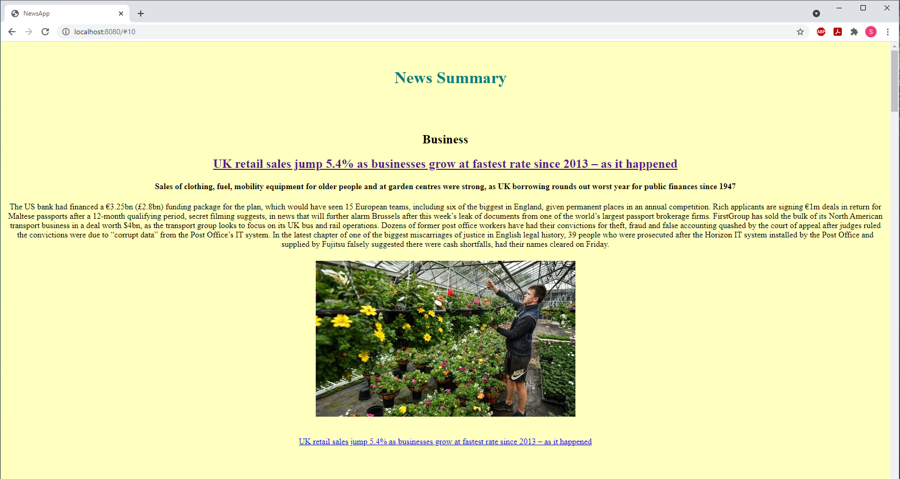

# News Digest



## Brief

The purpose of this project was to create a single-page web app, written purely in frontend code (without using any libraries or frameworks), which grabs and also summarises (using Aylien NLP text analysis) all the daily news from The Guardian newspaper API.

## Technologies used:

JavaScript

## User Stories

Some of these stories will need decomposing if they seem too large.

```
As a busy politician
I can see all of today's headlines in one place
So I know what the big stories of the day are
```

```
As a busy politician
I can see a relevant picture to illustrate each news article when I browse headlines
So that I have something nice to look at
```

```
As a busy politician
I can click a news headline to see a summary and a photo of the news article
So that I can get an in depth understanding of a very important story
```

```
As a busy politician
I can see click a news article summary title which links to the original article
So I can get a few more details about an important story
```

## Getting Started

The app is hosted on surge at the below address:

http://parched-queen.surge.sh

Alternatively, you can also clone the repository from GitHub:
```
$ git clone https://github.com/PiperS52/news-summary-challenge.git
```
Running on a local server, such as http-server:
```
$ cd news-summary-challenge
$ npm install --global http-server
$ http-server ./
```
