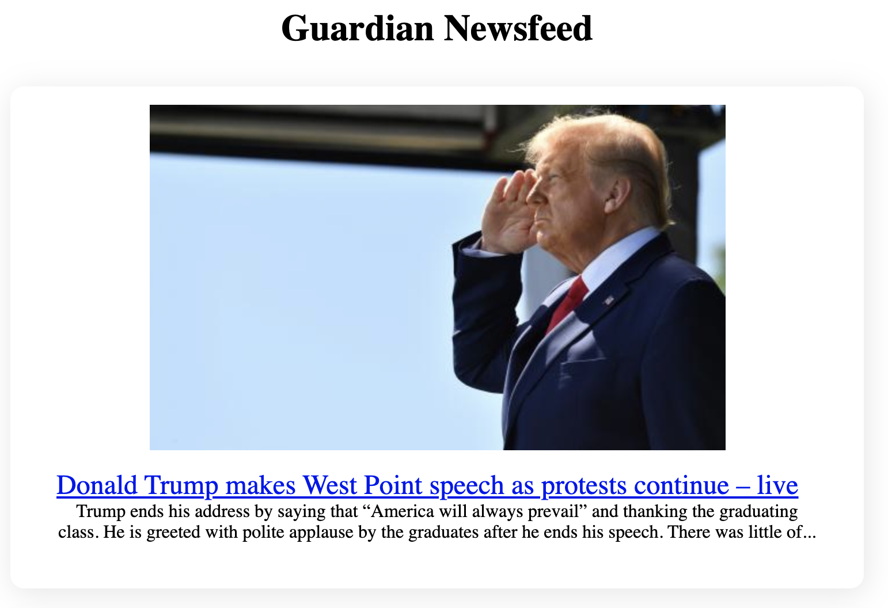

# Guardian News Summary

# Introduction
This repository has been made to get more comfortable with making API requests and testing them, while also building confidence in using and manipulating the powerful Guardian API. The application is made to show the 10 most recent news articles from the Guardian.

# Technology
The technology for this project is just CSS & HTML with vanilla javascript, to keep things as simple as possible. The testing framework is Jasmine.

# See it in action:

Above is an example of how an article is displayed, if you'd like to see the project in your browser, it's been deployed using [surge](http://guardian-top-10-feed.surge.sh/), so feel free to have a look there.

# feature roadmap
This project is still being worked on, below is a list of the future features to be implemented:
- make an API proxy server to obfuscate the API key.
- Allow the user to select specific categories of news.
- Allow the user to search for specific keywords in articles.